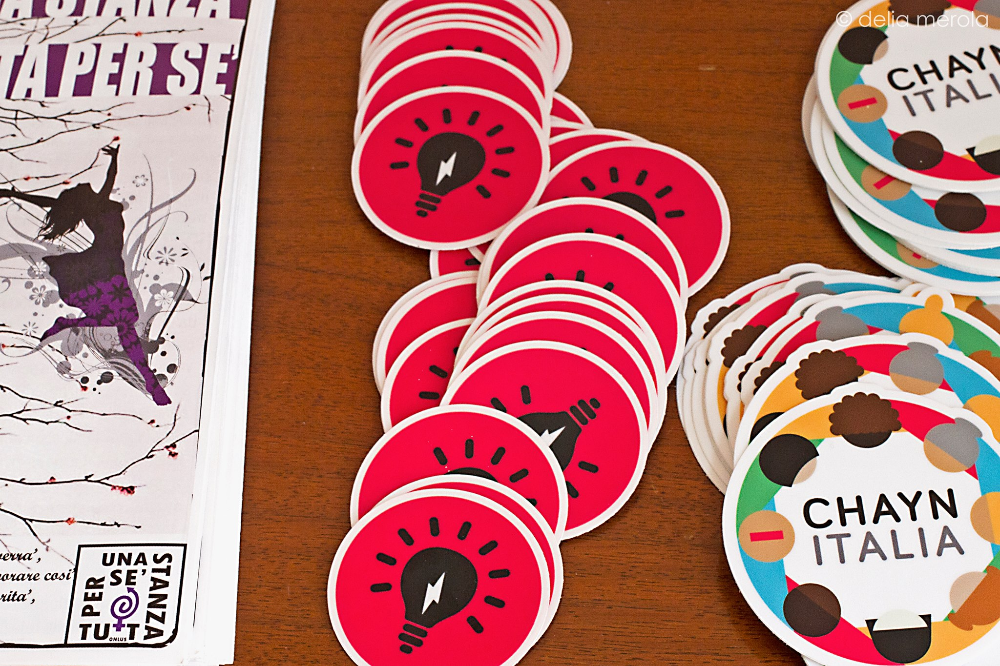

# 2016

In many ways 2016 was a difficult year for the women of the world. Indeed the social, political and economic challenges in the countries where we work often made us feel helpless but we charged on, doing what we can to support women and girls.

However, at Chayn our design philosophy of designing with and not for, and our agile approach to development, has always helped us maintain the belief that even small ripples can make big waves and throughout 2016 we witnessed the impact of the ripples we have been making over the last 3 years start to hit home as bigger-than-ever waves. This report goes into considerable detail about how we have achieved this bigger and more sustainable impact on women experiencing violence and oppression. We hope that you find the report inspiring and enlightening, but recognise time is precious so if you would like to only see the numbers, or the 'what' aspect of our impact, see our metrics below.

**We had a smashing year!**

Across all Chayn projects we reached more than

### 164 000 page views

#### 42 000 people

#### across 15 countries.

This bring our total reach from 2013 till now to

### 325 000 page views

#### 91 600 people

That's what we can track online but in 2016 we also had more direct contact with women using our services, including 86 students who attended our Ammal programmes and 2000 people who used Snapcounsellors. Our growth wasn't as big as we expected but that's because we spent the latter half of 2016 focusing on improving our internal processes to enable us to be more efficient and effective in 2017.

#### Top 20 countries for our projects

### Review of 2015

Before we begin to reflect on what we did last year, let's briefly recap key 2015 highlights for Chayn that led us to an exciting year in 2016. We learnt how to prioritise and focus on fewer projects at a time. We launched our legal toolkit: [How to build a Domestic Violence case without a lawyer guide](http://chayn.co/how-to-build-your-own-case/). Through a collaborative effort, this guide was launched at time when it was much needed in the midst of legal aid cuts which limited access to legal representation. We received considerable positive feedback especially from survivors, _"I wish I had read it 10 years ago. It has better advice in it than I have been ever given by any solicitor or the police about collecting evidence. I could have had TONS of evidence."_

We also began the work behind our privacy guide, to address the growing problem of online harassment and stalking, and gearing it for launch in 2016. We continued to push Chayn further and joined new partnerships to launch new projects: we partnered with International Alert to launch [PeaceHackBEY](http://chayn.co/peacehackbey/), a hackathon for women, youth and refugees in Lebanon. We also partnered with Techfugees to launch [EmpowerHack](http://empowerhack.io/), a hackathon to address the needs of refugee women and girls. Following its success, EmpowerHack has now spun off in a community of its own, run by 169 volunteers. We addressed the issue that women across the world face a language barrier in getting advice or help from Chayn. We began preparing for the launch of Chayn Italia for 2016. This was just a few of our many highlights of 2015. If you want to find out more about what happened in our second year running Chayn, read our [2015 Impact Report here](http://chayn.co/2016/03/08/impact-report-what-chayn-did-in-2015/).

## 1. How did we change in 2016?

#### New Partnerships

One of our key lessons from 2015 was about building more partnerships with local organisations to learn and share our work so in 2016, that's the first thing we tackled! To launch the Do It Yourself [DIY Online Safety Guide](http://chayn.co/safety/), we partnered with the UK branch of the international 'No More' campaign, [UK Says No More](http://uksaysnomore.org/), that aims to raise awareness to end domestic violence and sexual assault. With their help in promoting our guide on radio and social media, we reached many people! Chayn Italia also struck a number of partnerships with frontline shelters and activists, which you can read more about in their report back below.

#### Hackathons

As we learned from our experience in running hackathons, we decided that there would be no more stand alone hackathons. Instead we have moved towards a new model, which combines hackathons with a comprehensive follow up support. We've found that hackathons are extremely useful in creating ideas that has the potential to solve problems but rarely lead to a developed product. We wanted to avoid this and develop these ideas further where it can have a positive impact to society. A successful example of this is the [EmpowerHack](http://empowerhack.io/) model we co-created with the EmpowerHack community, that is now thriving with an amazing community of designers, technologists and committed citizens.

#### Internal organisation

We held our first ever Strategy day which, with a global volunteer base was quite challenging. However, we're happy to report it went really well and we were able to extract a lot of insight from our volunteers on what we do well, what we don't, how we can work better with on the ground organisations and stay focused.

We hold induction calls to introduce Chayn to our new volunteers, explaining what we do and how we do it. We've noticed that it can be overwhelming with the amount of information to take in during those calls. In order to help our new volunteers, we created a Volunteer Handbook with all the useful information to help them get onboard with Chayn quickly. The new volunteer handbook has proved to be useful as it complements our induction calls. It supports our induction calls with a guide to upskill on how to use apps \[i.e. Slack, Google Docs etc\] and how to navigate around Chayn.

#### Newsletter

To share our achievements and updates at Chayn, we released our first newsletter in June. It's a monthly update on our projects, and priorities for Chayn as an organisation. It's also a chance to shout out some \#ChaynLove with our 'Volunteers of the Month'. We also announce key skills we're looking for, at Chayn, to help support our projects. With responsibility falling on Exec team to get the newsletters out, we've recognised the difficulty to get newsletters out in busy months. We'll be addressing that with a dedicated 'Comms' \(Communications\) team in 2017 to take charge of all of our social media profiles, press releases and newsletters.

## 2. Highlights of 2016

### 2.1 Chapters

#### Chayn Italia

After months of hard work in 2015, Chayn Italia was launched in March 2016. As the first chapter of a non-English speaking country, Chayn Italia presented a big challenge as it tested the adaptability of Chayn's work model and its efficiency within a south european context. The results were excellent: more than 60 volunteers contributed to its creation and in only 6 months Chayn Italia was online.

We recruited a special team of lawyers, activists, psychologists, social workers, UX researchers and designers and web developers to work on the content for our launch, all of which was evaluated and signed off by survivors and social workers working in women's shelters before going live. This approach helped ensure we were providing the most valuable content we could. Indeed the success of this approach is quantifiable, as just 9 months after launching, we had 43 000 website pageviews, 8000 users, +2500 Facebook likes, and 482 Twitter followers. The majority of this traffic came from those accessing our content about signs of domestic abuse, our team and a map of all women's organisations and shelters.

Our social innovation approach to "gender based violence' issue presented a turning point amongst the italian online community, immediately attracting the national press. The project was featured in almost all of the most important online newspapers: [La Repubblica](http://ricerca.repubblica.it/repubblica/archivio/repubblica/2016/04/03/una-rete-femminile-contro-la-violenza40.html?ref=search), [Wired Italia](https://www.wired.it/internet/web/2016/03/30/lancio-chayn-italia/), [Il Fatto Quotidiano](http://www.ilfattoquotidiano.it/2016/05/16/chayn-italia-la-rete-per-aiutare-le-donne-vittime-di-violenza-dove-non-arrivano-le-istituzioni/2709410/), [La 27esima Ora del Corriere della Sera](http://27esimaora.corriere.it/articolo/una-piattaforma-digitale-contro-la-violenza-di-genere-chaynitalia-org/) and [many others](http://chaynitalia.org/dicono-di-noi/).

The online launch was followed by an official event in April, held at the " [Casa Internazionale delle donne](http://www.casainternazionaledelledonne.org/index.php/it/home)" in Rome, the historical location of feminist italian movement. The all day event gathered the international and italian Chayn family. The event held our Italian illustrators' exhibition to support the chapter, and a live performance of the 'Theatre of the Oppressed' that engaged the numerous audience members that showed up for the event.You can catch up with photos from Chayn Italia's launch event [here](https://www.facebook.com/pg/chaynitalia/photos/?tab=album&amp;album_id=1729975243890588)!

In June, we joined the grassroots Italian feminist movement [\#nonunadimeno](https://www.facebook.com/nonunadimeno/) against gender based violence. The goal of the movement is to start a new debate around gender based violence by creating a 'bottom-up' feminist plan to submit to the Government and local institutions. The movement was triggered after the tragic killing of a young woman in Rome1, and Chayn Italia immediately reacted by participating in several assemblies and meetings. We organized the social media campaign "cambiamo il finale" to support the demonstration held in Rome the 26th of November. Through a call out for illustrators, we collected [amazing artistic works](https://www.facebook.com/pg/chaynitalia/photos/?tab=album&amp;album_id=1806280102926768) that showed different aspects of gender based violence: the need for sisterhood, the importance of safe shelters, the influence of toxic narratives. Each facebook post reached almost 20.000 visualizations, shared by an average number of 50 people. Our gifs and visual materials were used by the movement as an example of good online communication. Several organizations imitated our unique approach that united irony with powerful images. Our volunteers also contributed to the social media coverage of the demonstration of 26th of November, where more than 250,000 women showed up demanding an end to violence against women.

2016 was also the year of many new collaborations. In November, Chayn Italia celebrated the launch of our online course ["Active tools against gender based violence"](https://platform.europeanmoocs.eu/course_chayn_strumenti_attivi_contro_) in collaboration with the EU funded EMMA Platform and the University of Naples Federico II. To date, more than 600 participants have benefited from this course that aimed to raise awareness on domestic violence, its legal framework, how to help women in need and how the topic is reported in italian media. The course received many enthusiastic comments and was used also by the auditors for training in offices, by school teachers for their students and by journalists to learn how to adopt a respectful narrative to talk about domestic violence. After this success, we are working on transferring all our materials from the course onto Chayn Italia's web content.

Chayn Italia pursued new **outreach approaches** to continue to access diverse audiences of women who would benefit and contribute to Chayn's work. We collaborated with [Radio Bullets](https://medium.com/chayn-italia/chayn-è-in-radio-c5db9f3700e6#.8nqiejbt7) to produce international news on women's issues & provide information about Chayn's services. We started a [blog](https://medium.com/chayn-italia/chayn-italia-apre-uno-spazio-per-testimonianze-e-racconti-cf27bd3aefe7) with survivors' personal stories, where women can narrate their experiences and provide their insights. This constructs a new narrative on gender based violence that is woman-centric and highlights its cultural origin. Usually the italian narrative lies with victim blaming and defending the perpetrator, our attempt is to underline the cultural contradictions and overcome them with powerful narratives and personal stories.

Since December 2016, our T-Shirts with our visual designs and logos, can be purchased through [Worth Wearing](https://worthwearing.org/store/chayn-italia-strumenti-contro-la-violenza-di-genere/chayn-italia-strumenti-contro-la-violenza-di-genere) to support Chayn Italia projects.

#### Chayn Pakistan

 It's been a quiet year for Chayn Pakistan. For most of the year, we struggled to have a consistent team of Pakistani volunteers which is why we were not able to finish the guide that was in progress: How to deal with abuse on campus.

We also struggled with updating our information on shelters and charities. This was most apparent when we started getting emails, and direct messages on Facebook from people complaining distraught women were calling their home numbers, mistaking them for shelters. We were horrified when it happened for the third time and checked our records. Our numbers were correct and in line with what we had gathered from official websites so what could be possibly wrong? The unfortunate reason for this is that many charities/shelters have shut down operations due to lack of resources or haven't paid their telephone bills so their numbers have been re-assigned.

Though our Pakistan chapter had a tough year, our piece on the tragic murder of Qandeel Baloch, " [We Killed Qandeel Baloch](https://medium.com/chayn-pakistan/we-killed-qandeel-baloch-cf1a1e790d3f#.l880jc7h4)", which broke the spirits of many of our volunteers and [video](https://www.facebook.com/ChaynPak/?fref=ts) remains our most widely read blog of the year.

This year, we didn't reach as many women as we wanted to through our website. We only engaged with 3700 people and only generated 12000 views. Our most popular piece of content was how to find housing and shelters, charities that can help and how to deal with forced marriages. We also know that most of our site visits come from Pakistan, UK, India, UAE, Canada, Italy and Australia.

In 2017, we're going to be focusing on translation, and mapping of services.

#### Chayn India

Chayn India had a busy year! We researched and developed the " [Abusive Relationships, Stalking & Harassment Guide for Teens](http://chaynindia.com/abusive-relationships-stalking-harassment-guide-for-college-students/)" which supports young people in abusive relationships to understand the signs and seek for help. We also added new content on sexual health and abuse in same sex relationships.

The biggest achievement for our India chapter was the Snapcounsellors collaboration \(which you can read below\).

We reached 16,800 people with 48 000 plus pageviews across many countries including India, US, UK, UAE, Australia, Canada, Russia, and Malaysia. Our most popular content was about divorce and child custody laws and forced marriage.

In 2017, we'll be focusing on improving our law and divorce section and engage more frontline charities in India.

### 2.3 Collaboration

#### EmpowerHack

We continued to build our expertise in developing and facilitating **hackathons**. In response to the global migration crisis and acknowledging the fact that 75% of refugees worldwide are women and children, [Empowerhack](http://www.notsopopular.com/blog/empowerhack-inclusive-humanitarian-tech-with-a-focus-on-women) was created at the end of 2015. Empowerhack's aim was to build sustainable humanitarian technologies for women and girls facing migration crisis. We started with a one weekend-long hackathon at the end of November. Within months, we grew to an amazing global community of hundreds of skilled volunteers - from health advisors, community specialists, interaction designers, developers and entrepreneurs and NGOs working together. Today, our core projects include digital solutions in peer support for refugee safety and improved access to reproductive healthcare for pregnant refugee women.

The Empowerhack team then launched a follow up design event, a global humanitarian health hackathon across three cities: Accra, London and Amsterdam to fuel a continuing conversation around issues such as mental health, reproductive health and patient-led health data.

* [Carry that Weight: Reproductive Health in Refugee Setting](http://blogs.lshtm.ac.uk/marchblog/2016/04/01/carry-that-weight-reproductive-health-in-refugee-settings/)s \[MARCH Centre Blog Maternal, Adolescent, Reproductive, and Child Health\]
* [Hacking The Refugee Crisis](http://culturalagencycollective.com/hacking-the-refugee-crisis/) \[Cultural Agency Collective\]
* [Empowerhack Health London Event](https://www.facebook.com/events/1275051999188432/) + [Article](http://londonist.com/2016/04/refugee-crisis-there-s-an-app-for-that) \[Londonist\]
* EmpowerHack Health Amsterdam Event + [Article](https://techfugees.com/events/recap-of-refugee-health-hack-in-amsterdam-by-empowerhack-techfugees/) \[Techfugees\]

On the back of [Empowerhack](http://empowerhack.io/), we developed one of our earlier ideas. Soul Medicine is a service designed to empower women experiencing abuse by providing them with access to crowdsourced courses on accessing legal services and managing finances delivered in bite-size chunks via email, SMS or Facebook messenger. It is still under development and we're working with refugees and syrians who still live in syria to ensure that it's responsive to their needs. We're gearing it up for launch in 2017! We're proud of how Empowerhack has turned into a thriving community of its own!

#### Snap Counsellors

[Snap Counsellors](http://snapcounsellors.com/), the micro-counselling abuse helpline on Snapchat for teens was the highlight of 2016! Started as a brain child of Rajshekar Patil, an advertising professional, it became a partnership between our long time friend Avani Parekh, an experienced counsellor and founder of LoveDoctor.in, and our own Nida Sheriff, founder of Chayn India. After launching in March, it has taken off and attracted world-wide recognition. This campaign has received multiple awards and went viral across social media. You can read about all the awards in our 'Awards and Press' section below. Almost 1,200 people watch the stories Snap Counsellors posts, and as many as 60 people reach out for help every day.

In October, Snapcounsellors partnered with a US-based non-profit, [DayOne](https://www.dayoneny.org/) as a counselling partner. The Day One team offers live support on the @lovedoctordotin Snapchat handle, creating live Snapchat Stories to educate subscribers about relationship abuse and domestic violence, and directing vulnerable users to resources, information, and help. This partnership and campaign has been one of the best. Special shout out to Avani for running the helpline, Raj for approaching us with this unique concept and our Nida for making this happen!

#### Tech Vs. Abuse Research

Chayn formed a new partnership with SafeLives and Snook in a research collaboration - " [TechVsAbuse](http://www.techvsabuse.info/)", funded by Comic Relief. We explored how women in the UK use tech to deal with abusive relationships. We wanted to find out potential opportunities for technology to "_play a supportive role in the context of domestic violence._" This research followed a process of user-research which focused on understanding key behaviours, needs, and motivations. We carried out contextual interviews and observations, focus groups and participated in survivor-led Facebook groups, and workshops. In 6 months, we collected insights from over 200 women and 350 practitioners who participated in this research.

From the insights gathered, we identified that there were four distinctive stages in a woman's abusive relationship, each with a specific set of needs in each stage: "Unaware, Aware, Leaving, Recovering." You can find out more about our research findings in our report [here](http://media.wix.com/ugd/f86f13_366b6514c8fc4e9488fc15edf2148d52.pdf). Based on the research findings, the team created 5 design challenges calling for solutions that would make an immediate difference to victims and survivors of domestic violence. You can find the design challenges [here](http://media.wix.com/ugd/f86f13_baa081595ece4abca3a4062089a9d43c.pdf).

Through teamwork, brainstorming and learning new tools, our partnership has proved that it's possible for four organisations to successfully work together in the third sector. We thoroughly enjoyed working together and we take away a lot of memories and knowledge that we can apply to Chayn projects internally.

### 2.3 Projects

#### Ammal

Early in the year we launched Ammal: a peer-to-peer women's development network. Ammal gives women access to free open-sourced training in digital skills and creates a \#SheforShe peer-support network designed to help women navigate their lives and careers. In 2016, 64 women gained a new skill or skill through attending Ammal workshops. Attendees provided positive feedback stating that they felt increased confidence and would recommend Ammal to their friends. Some of the attendees have joined Chayn as volunteers to boost their experience and to give back to the community. You can read our Ammal UK Impact report [here](https://docs.google.com/document/d/1flFGruuZ3PadVM5FRx-BAP7j7b9o0HRq3G_f9DU3mqI/edit?usp=sharing)!

In November, we launched the Pakistan chapter of Ammal with a bootcamp of four workshops in Lahore. Our aim was to provide equitable access to career skills, tailored to the unique socioeconomic conditions of Pakistan. We started with a small pilot group of 10 female students between the ages of 18-24 years from a conservative women's college. We were joined by more participants from 2 other institutes over the course of the bootcamp-including teachers and scientists! We provided them a crash course on career planning, professional development, CV writing, interview training, and the basic digital skills that support these. We kept it as hands-on as possible and encouraged discussion, which helped participants open up about the particular discrimination they face as women who wish to pursue a career in a patriarchal society. This was followed by brainstorming and peer advice on ways to counter this discrimination. It was heartening to see this kind of grassroots feminism in action. At the end of the bootcamp, the attendees expressed much more confidence in their career skills, and were gutted there weren't more classes coming up! They also volunteered as speakers for future bootcamps.

### 2.4 Toolkits

We focused on creating and sharing more accessible guides using an iterative approach of gaining feedback from our readers and experts and developing it further in response to their concerns. This is crucial in ensuring that our guides is useful and meets our readers' needs.

#### Privacy guide

2016 saw the completion of our [**DIY Online Safety Guide**](http://chayn.co/safety/). The DIY Online Safety Guide offers practical, easy to follow advice on staying safe online and protecting your identity. The guide provides everything you need to know about how you can be tracked online – and how to hide your tracks on email, browsers, Facebook and other social media platforms. It is available in 8 languages and is useful irrespective of your gender, location or situation.

#### How to Build Your Own Domestic Violence Case Without A Lawyer

Our volunteer Charlotte carried out her research thesis: [Measuring the impact of the "How to Build Your Own Domestic Violence Case Without A Lawyer" toolkit](https://medium.com/hack-for-chayn/measuring-the-impact-of-the-how-to-build-your-own-domestic-violence-case-without-a-lawyer-toolkit-73b9b9ba6b66#.gxgyyardd). Over the summer of 2016 she conducted a document analysis of the toolkit in order to formulate an interview guide. This was used to interview women who had used the toolkit or had a hand in its formulation after having experienced abuse and service providers who have or may recommend the use of the toolkit. The interview focused on the acceptability and usability of the toolkit as well as where improvements could be made. Analysis of the interviews alongside the content identified two areas for further work:

1. **Recommendation for policy and practice:** It may be best used in combination with other services, recommended by service providers, as part of a comprehensive range of services aimed at reaching women in an array of abusive situations and relationships.
2. **Recommendation for further research:** More research on user needs should be done with women who are least likely to be reached by face to face service providers, in particular women with disabilities. This would also involve advice and information on how best to assist a disabled family member or friend who is facing abusive relationships.

We also completed the [Urdu translation](https://docs.google.com/document/d/1mJiKBjbaqf8NG1WAgOQKEw6Ma1FRvoofKBv739RU2lk/edit) and the [Urdu podcast](https://soundcloud.com/chayn-hq/wakeel-kay-beghair-gharelo-tashadud-case-az-khud-tayar-kernay-ki-guidebook)!

## 3. Awards and Press

We were fortunate to receive recognition for our work, recognition that will help us spread the word even further! The Observer and Nesta chose Chayn as one of their [New Radica](https://www.theguardian.com/theobserver/2016/jul/10/new-radicals-observer-nesta-story-winners-2016) [ls](https://www.theguardian.com/theobserver/2016/jul/10/new-radicals-observer-nesta-story-winners-2016), celebrating our innovative for approach for social change. We were also semi-finalists for the [WIRED Audi Innovation Award](http://www.wired.co.uk/article/category-4-social-innovation) [s](http://www.wired.co.uk/article/category-4-social-innovation) recognising the creative way we use technology and practice survivor-led design. We are also thrilled to announce that Nominet Trust, the UK's largest social tech funder has named Snap Counsellors as one of the [top 150 social tech projects of the year](http://www.socialtech.org.uk/projects/snap-counsellors/). We were picked from amongst 700 top organisations from around the world! Our SnapCounsellors campaign partnership won [Two Kyoorius Creative Awards in India](https://medium.com/hack-for-chayn/chayn-indias-innovative-campaign-to-counsel-teens-through-snapchat-wins-two-awards-at-india-s-21e073093f55#.xtlpn346u) and the ['Graphite Pencil' for D&AD Impact Award 2016](https://medium.com/hack-for-chayn/snap-counsellors-scoops-a-graphite-pencil-for-d-ad-impact-award-2016-186a0c848e08#.yd6ty6ocj).

### Press

In addition to these awards, our work and our volunteers also received lots of coverage in the press:

* Maryam Amstrad was quoted in The National in their article ["Don't use Orlando Shootings to demonise Islamic Communities"  ](http://www.thenational.scot/news/14903503._Don_t_use_Orlando_shootings_to_demonise_Islamic_communities___say_prominent_LGBTI_Scots/)
* [Wired covered](http://www.wired.co.uk/article/empowerhack-technology-help-female-refugees)the hackathon that we ran with EmpowerHack to develop tech solutions for refugees.
* Our snapchat campaign was highlighted in [Cosmopolitan](http://www.cosmopolitan.co.uk/reports/news/a42131/snapchat-account-teens-domestic-abuse/) and [The Huffington Post](http://www.huffingtonpost.com/entry/snapchat-is-helping-teens-in-abusive-relationships-get-help_us_56f2e0b1e4b0c3ef52179f9e?ir=Women&amp;section=us_women&amp;utm_hp_ref=women&amp;ncid=fcbklnkushpmg00000046), [Mashable](http://mashable.com/2016/03/20/snapchat-helpline-account-abuse/#Bg5IUI3O1sq7) among many other blogs and news outlets.
* [Mouthy Women Interview](http://mouthywomen.work/post/152116462931/hera-hussain-tech-activist) with Hera
* [Project Ada's Interview on 'How Hera Hussain helps women empower themselves through technology'](http://www.projectada.co.uk/interview-hera-hussain-helps-women-empower-technology/)
* [BBC Asian Network Interview on Chayn's DIY Online Safety Guide](http://www.bbc.co.uk/programmes/b083l4sv) with Amina
* talkRadio Interview on Chayn's DIY Online Safety Guide with Aliya
* [UNAIDS Interview on Snapcounsellors](http://www.un.org/youthenvoy/2016/04/unaids-interview-snapchat-becomes-hotline-abusive-relationships/) with Nida
* [Up and Coming: Hera Hussain of Chayn](http://www.thirdsector.co.uk/coming-hera-hussain-chayn/management/article/1391836) \[Third Sector\]

## 4. Challenges

**2016 hasn't been without its challenges.** Perhaps the biggest challenge was managing the high workload experienced throughout Chayn. Volunteers manage their Chayn commitments on top of their jobs, if this isn't carefully supported it can cause severe burn out and it happened with a few people in our team. In 2017, we'll be exploring different ways to minimise this.

An important characteristic of Chayn is our flexibility in terms of volunteer participation. This fluidity help makes us the dynamic organisation we are, however it can create issues in terms of volunteer commitment. In 2017, in order to ensure that our volunteers will be actively and steadily participating in the future, we have decided to change our recruitment process. We have identified important points that must be emphasised when recruiting new volunteers: they must be comfortable with the use of facebook, not just joining facebook in order to get involved in Chayn; they must be able to commit a minimum time of 8 hours per month in order to ensure engaged participation; and finally, personal initiative is at the core of our organisation, we are doing our best to recruit volunteers who will be able to work independently and take initiatives once they have understood how we work. Moving forward we are figuring out the most efficient way of encouraging volunteers to remain engaged with our community after they have joined. Our aim is to let them explore our channels, but also find them a task to begin with as quickly as possible, which can then lead to onboarding a specific project. We'll be blogging about these changes in the coming months!

#### Supernova

We kicked off Supernova in 2016 but it was put on hold due to overwhelming work load. We thought it would be best to focus on releasing the guides that were in progress before launching new projects. We'll be revisiting Supernova in 2017 and gearing it up for launch. Watch this space!

#### Technical Language

As we continued to develop guides and public information we grappled with the challenge of simplifying technical information into a form that is easily accessible and digestible. This challenge was particularly felt during the development of the privacy guide which required us to translate very technical concepts into an easy-to-understand guide with easy to implement recommendations to keep users safe online. We are now working internally to get feedback of what did and didn't work and how we ensure that technical information is understood by people we are hoping to reach.

## 5. Special Thanks

**Finally, and in many ways most importantly,** [**we celebrated the tireless contribution of Nida**](https://docs.google.com/document/d/1HOkrEHUuus1KFsjdpdQmL5aZWzAJv4zHlzZL6kO-bZk/edit). Some of you may have met her or seen her online or know her as the founder of Chayn India.We can't imagine Chayn without Nida and as she transitions on to new things it will be a difficult transition for us. Thankfully, with her help, we have built a strong foundation of inclusion and support. Her dedication and energy is infectious and was fundamental in creating the atmosphere of sisterhood and fun that makes Chayn so dynamic. Nida will always be our Chayn soul sister. We wish her the best of luck in her projects!

#### Some other things we said and wrote...

We participated in more **talks and events** to increase Chayn's visibility and profile.

* We collaborated with the Dutch Embassy for International Human Rights day as part of the UN's 16 Days of Activism on the [Design 4 Change discussion](http://unitedkingdom.nlembassy.org/news/2016/12/design4change-design-for-women’s-rights.html). The conversation was [livestreamed](https://www.facebook.com/dutchembassyUK/videos/10154492036456886/) and over 40 people attended the evented and contributed to the conversation. Topics covered included modern slavery, sexual harassment, human trafficking and early child marriage with the aim of encouraging attendees to enter a design competition inspired by the main themes of the conversation.These designs will be showcased in March to mark International Women's Day. Read more [here](https://medium.com/hack-for-chayn/design-4-womens-rights-e1a0a3d49d04#.plqc2m9c1).
* Jess introduced our projects at Tech for Good's meetup on [Technology and Justice](https://www.meetup.com/techforgood/events/230145628/) to show Chayn is using tech to empower women against violence and oppression.
* Chayn provided snapcounsellors as a brief for [Fearless Future's first Gender Equality Accelerator](https://medium.com/hack-for-chayn/accelerating-change-in-gender-inequality-a04486d4445d#.uby7gws09) in London.
* Afsa introduced Chayn at ['Riposte Presents' on Tech & Innovation](http://www.ripostemagazine.com/riposte-presents-tech-innovation/)
* We took part in \#EmpowermentHour with [Mandy Sanghera](https://twitter.com/Mandy_Sanghera1) and others on domestic violence and legal aid. You can catch up from [Kristin](https://twitter.com/kris_mathiesen) on the highlights [here](https://medium.com/@kristinmathiesen/chayns-empowermenthour-with-mandy-sanghera-domestic-violence-legal-aid-ed8f3706eb0a)
* [We joined @AJStream on twitter](https://twitter.com/herahussain/status/808649185503416320) discussing online harassment. Follow \# [AJCyberRights](https://twitter.com/hashtag/AJCyberRights?src=hash) to recap what happened.
* Hera talked to Womanity Foundation for [\#ICTforWomanity](http://womanity.org/ictforwomanity/) Network Series on [how Chayn harnesses ICT and new media to prevent violence against women](https://www.youtube.com/watch?v=01DsvO2GCmE&amp;feature=youtu.be)
* Hera talks about ['How women survivors are taking back the power through technology'](http://www.tedxeastend.com/event2016/hera-hussain/) at TedXEastEnd
* Hera and Elena attended NEON's Power & Privilege retreat to explore ['How does power and privilege affect our movements and what leadership do we need?'](http://campaignlab.org.uk/lab/four/) as part of Campaign Lab 4 course
* Hera joined a [video conference for Global Tech Women](http://www.globaltechwomen.com/2016-voice-conference-links.html) along with Womanity Foundation, Champlain College Emergent Media Centre, Johns Hopkins School of Nursing, Tactical Tech Collective and Association for Progressive Communications to discuss ['How ICT's Can Help Prevent Violence Against Women'](https://youtu.be/PslZ-rg3N2g)
* Hera joined [Baroness Verma](https://twitter.com/baroness_verma?lang=en) \[Ministerial Champion on Violence Against Women and Girls\] and [Mor Rubinstein](https://twitter.com/Morchickit) \[Open Knowledge International\] in a panel at WOW 2016 in Southbank Centre on ['Women, Corruption, Peace and Security'](https://soundcloud.com/chayn-hq/sets/talks-panels-and-shows-chayn)

**Chayn team members continued to share their insights through their writing**

* [100 Women Around the World Told Us How They Practice Self-Love - What They Say May Surprise You!](http://chayn.co/2016/02/13/100-women-around-the-world-told-us-how-they-practise-self-love-what-they-said-may-surprise-you/)
* [Why I run with Chayn to fight violence against women — and you should too](https://medium.com/hack-for-chayn/chayn-in-support-of-the-international-day-for-the-elimination-of-violence-against-women-ebe29911a52a#.9ihvxkuci) \[Medium\]
* [Non Una Di Meno: Not A Woman Less. Thousands of women takes to the streets in Rome to protest violence against women](https://medium.com/hack-for-chayn/non-una-di-meno-not-one-women-less-d146e577a0fc) \[Medium\]
* [Chayn — Semi-finalist in WIRED AUDI Social Innovation Awards](https://medium.com/hack-for-chayn/chayn-semi-finalist-in-wired-audi-social-innovation-awards-e4add2d62e2e) \[Medium\]
* [Snap Counsellors scoops a 'Graphite Pencil' for D&AD Impact Award 2016!](https://medium.com/hack-for-chayn/snap-counsellors-scoops-a-graphite-pencil-for-d-ad-impact-award-2016-186a0c848e08) \[Medium\]
* [Chayn India's innovative campaign to counsel teens through snapchat wins two awards at India's prestigious Kyoorious awards](https://medium.com/hack-for-chayn/chayn-indias-innovative-campaign-to-counsel-teens-through-snapchat-wins-two-awards-at-india-s-21e073093f55) \[Medium\]
* [Synthesising research about how abuse survivors & practitioners use tech](https://medium.com/hack-for-chayn/synthesising-research-about-how-abuse-survivors-practitioners-use-tech-b57eef9747fa) \[Medium\]
* [Tech vs Abuse: A new collaboration to explore how women in UK use tech to deal with abusive relationships](https://medium.com/hack-for-chayn/tech-vs-abuse-a-new-collaboration-to-explore-how-women-in-uk-use-tech-to-deal-with-abusive-5b6a660d2c68) \[Medium\]
* [All In A Month's Work: Chayn Italia Launches, Snap Counsellors Goes Viral & Ammal Goes Designing](https://medium.com/hack-for-chayn/march-2016-chayn-on-fire-c72da7dc2fa2) \[Medium\]
* [Those Poor Rural Women](https://medium.com/hack-for-chayn/those-poor-rural-women-bcda261f0043#.pzwbn5xqg) \[Medium\]
* [Chayner Maryam Amjad speaks out in The National Scot against Islamophobia blacklash following Orlando Massacre](https://medium.com/hack-for-chayn/chayner-maryam-amjad-speaks-out-in-the-national-scot-against-islamophobia-blacklash-following-63620c379972#.edlmrbjhg) \[Medium\]
* [How volunteering can help you recover from a traumatic experience](https://medium.com/hack-for-chayn/how-volunteering-can-help-you-recover-from-a-traumatic-experience-39b4101e64ed) \[Medium\]
* [How can tech solutions help women and girl refugee health?](https://medium.com/@charjsm/how-can-tech-solutions-help-women-and-girl-refugee-health-429495e0b5ec#.e9zbdkz1p) \[Medium\]
* [\#MaybeHeDoesntHitYou: Heartbreaking accounts of emotional abuse from survivors](https://medium.com/@chayn/maybehedoesnthityou-heartbreaking-accounts-of-emotional-abuse-from-survivors-e476899cb7be#.gwwnzafol) \[Medium\]
* [How chronic illness communities support each other online](https://medium.com/@TheRehn/i-recently-watched-hera-hussain-s-tedx-talk-on-youtube-about-how-women-are-using-the-internet-to-1cc8a38b2e07#.n0z1seix1) \[Medium\]
* TATA Consultancy Services' [Case study on Chayn Labs](http://sites.tcs.com/generation-direct/case-studies/hera-hussain/)
* [It is not okay to compromise on abuse, even if you're married!](http://blogs.tribune.com.pk/story/32467/it-is-not-okay-to-compromise-on-abuse-even-if-youre-married/) \[The Express Tribune\]
* [Up and Coming: Hera Hussain of Chayn](http://www.thirdsector.co.uk/coming-hera-hussain-chayn/management/article/1391836) \[Third Sector\]

And that's not all! Check out what our fabulous volunteers have written for [Chayn Pakistan](https://medium.com/chayn-pakistan), [Chayn India](https://medium.com/chayn-india) and [Chayn Italia](https://medium.com/chayn-italia).

Thanks for sticking through to the end of our report! If you liked it, share it with your network. Here's to a successful 2017!

