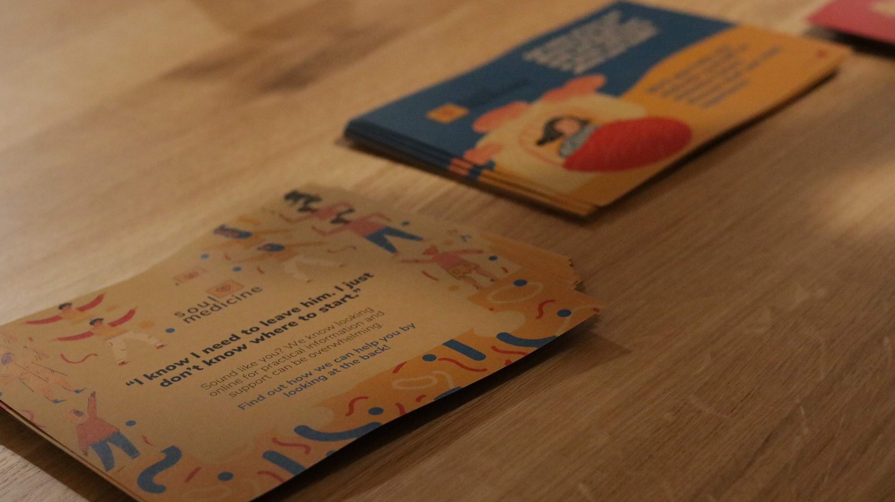
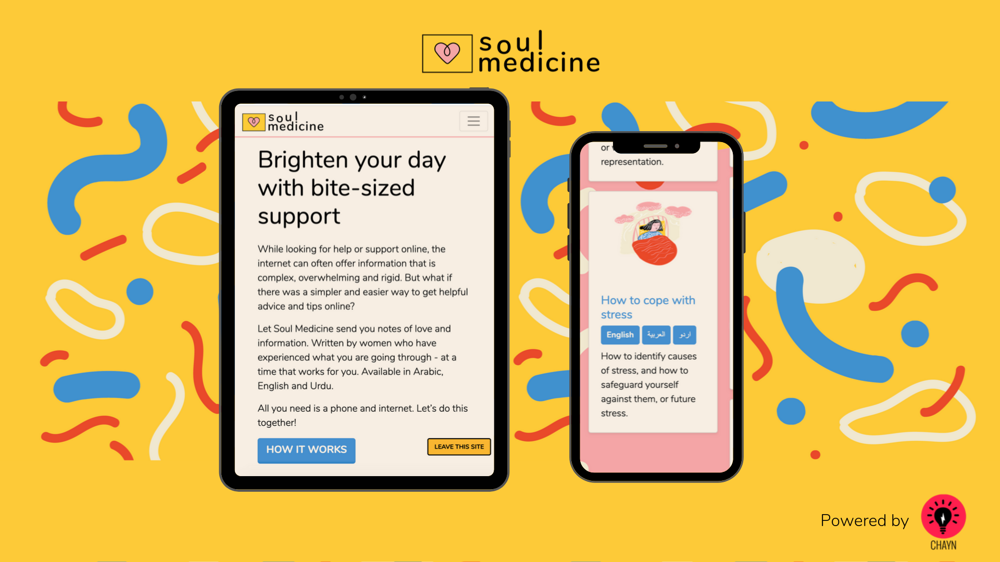

# 2019 in a snapshot

Every year, Chayn continues to grow and develop — and 2019 was no different! We launched several new resources and started work on our most ambitious projects yet. We received a great amount of press, applied for numerous grants and sent volunteers around the world to attend conferences and represent.

In this report, you’ll find information about our organisation — who we are, what we do and how (successfully!) we do it. You’ll find updates on 2019’s biggest events, including the launch of a new guide, _Getting Better & Moving On_, AND huge progress on two of our major tech platforms, Soul Medicine and YANA. This year, we also had the honour of attending a number of incredible events, like the GitHub Universe Conference in San Francisco and The Modern Films / Kering Foundation 16Films16Days festival in London, UK. And top it all off, we left our fiscal sponsor, CIVA, and became a social enterprise!

Of course, 2019 was not without its challenges. We struggled to prioritize communications and marketing, something we’ve reflected on extensively and are excited to change in 2020. As always, we had trouble finding contractors who were both aligned with our mission and able to reliably complete projects. We’ve had some technical hiccups and, at times, been stretched a little too thin. 

But we’ve also seen incredible growth and financial support. In 2019, Chayn was awarded a total of a little over than £88 000 in grants to fund our various projects. Slowly but surely, we’re making the world a better, safer place for survivors of abuse and the people who love them. 

### Chayn

##### Are you reading about Chayn for this first time? This is the right section for you. For friends, skip to the next section, “Highlights”.

Chayn curates and creates intersectional, feminist resources for people impacted by gender-based violence. A non-profit organisation, our mission is to support and empower survivors through smart, accessible technology. 

Our approach is:

*   **Survivor cented**. Our work focuses on addressing the unfulfilled needs of survivors. We build resources with, rather than for, our community, and offer judgement-free support at every stage of a person’s journey. 
*   **Volunteer led**. Our organisation relies heavily on a corps of highly motivated, passionate individuals who generously donate their time and knowledge.
*   **Project based**. Our contributors work collaboratively, bringing their diverse skills to specific projects rather than siloed teams. 

##### Projects
At Chayn, we like to stay busy! We’re continually supporting a number of projects, including: 

###### Easy-to-Follow, Crowdsourced Guides

Our guides — built by survivors and edited by experts — are freely available in multiple languages for our friends around the world. Our guides fall into three categories: detecting and handling abuse, legal information and general well-being. 

**Detecting and Handling Abuse**
*   [Manipulation Is Abuse](https://manipulation.chayn.co/): help identify manipulative situations, find support and leave controlling relationships. 
*   [The Good Friend Guide](https://chayn.gitbook.io/the-good-friend-guide/): learn how to be a supportive family member or friend to someone experiencing abuse. 
*   [DIY Online Safety](https://chayn.gitbook.io/diy-online-safety/english): understand how to protect yourself online. 

**Legal Information**

*   [Building Your Own Domestic Violence Case Without a Lawyer](https://chayn.gitbook.io/how-to-build-a-domestic-abuse-case-without-a-lawye/): collect and present evidence of abuse.

**Well-Being**

*   [Getting Better and Moving On](https://www.gettingbetter.chayn.co/how) (New in 2019!): get familiar with your emotions, read about the experiences of other survivors and seek self (or professional) care.

###### Local and Community-Specific Networks

Chayn was designed with the global user in mind, but over time we’ve developed affiliate networks that provide local information and support in [India](http://chaynindia.com/), [Italy](http://chaynitalia.org/), and [Pakistan](ChaynPakistan.org). We’ve also partnered with the [Supernova Project](http://supernovaproject.org/), which aims to address abuse within the LGBTQIA+ communities. 

We are always looking for partners who want to become new country and community affiliates.

###### Digital Platforms

Our digital platforms are comprehensive, interactive spaces where survivors can learn about and receive support for abuse. As of today, Chayn maintains — or is currently building — these tools: 

*   [Soul Medicine](https://soulmedicine.io/). Soul Medicine hosts several digital courses designed for survivors of abuse. Broken down into bite-size pieces, each pathway is easy to follow and intended to help survivors on their journey to recovery. Soul Medicine includes all five Chayn guides and three additional courses. 
*   [Little Window](www.chayn.co). Little Window is a smart search bot that quickly directs Chayn.co visitors to our site’s most relevant information.
*   YANA (You Are Not Alone). YANA will be the world’s largest collaborative resource for survivors of abuse. From detecting abuse through reporting, trial and ongoing aftercare, YANA compiles vetted information to help survivors during their personal journeys. 

###### Team

At Chayn, we have the best team in the world (it’s true!). Although some of our contributors are reimbursed for their time, the majority of our group is made up of dedicated, enthusiastic volunteers from all over the world. 

Volunteers participate in the projects that interest them most. The Executive Team (ET) coordinates all projects and is responsible for the administration of Chayn as well as all its strategic decisions. In 2019, our Executive Team included: 
*   [Hera Hussain](https://twitter.com/comicrelief/status/1200449251521769473), Chayn’s Founder and Director
*   [Nooreen Khan](https://twitter.com/nooreenmanzoor), People Lead 
*   [Rosie Maguire](https://twitter.com/_rosiemaguire?lang=en), Partnerships Lead
*   [Tiffany Lo](https://twitter.com/dev_tiffanylo), Tech Lead

Since we registered as a social enterprise (a community-interest company), a type of non-profit. Our directors are Hera, [Dama Sathianathan](https://twitter.com/dama_yanthy?lang=en) and [Leila Hoballah](https://twitter.com/leilahoballah?lang=en). Our members are [Elena Silvistrini ](https://twitter.com/ellesilvestrini?lang=en)(Founder of Chayn Italia), [Rosie Maguire](https://twitter.com/_RosieMaguire) and [Nooreen Khan](https://twitter.com/nooreenmanzoor). We explain this more at the end of the report.

## 1. IMPACT NUMBERS

In 2019, across all projects we had **45,384 sessions**, served **41,934 unique visitors** and garnered **106,795 page views**. 

That brings our lifetime total to **269,120 sessions** and more than **1.3 million page views**! 

<table>
  <tr>
   <td><strong>Year</strong>
   </td>
   <td>2013
   </td>
   <td>2014
   </td>
   <td>2015
   </td>
   <td>2016
   </td>
   <td>2017
   </td>
   <td>2018
   </td>
   <td>2019
   </td>
   <td>Total
   </td>
  </tr>
  <tr>
   <td><strong>Unique visitors</strong>
   </td>
   <td>7,779
   </td>
   <td>6,737
   </td>
   <td>30,439
   </td>
   <td>42,628
   </td>
   <td>114,590
   </td>
   <td>144,677
   </td>
   <td>41,934
   </td>
   <td>388,784
   </td>
  </tr>
  <tr>
   <td><strong>Page Views</strong>
   </td>
   <td>18,199
   </td>
   <td>20,567
   </td>
   <td>114,467
   </td>
   <td>164,733
   </td>
   <td>411,613
   </td>
   <td>477,030
   </td>
   <td>106,795
   </td>
   <td>1,313,404
   </td>
  </tr>
</table>

We’re super proud of our user activity and our cumulative lifetime impact, but some of these figures need to be further explained. 

In previous years, we’ve focused aggressively on marketing and communications, drawing as many users as possible to our site. In 2019, we turned our attention to strengthening our major digital platforms, YANA and Soul Medicine. We also worked hard to build partnerships with other organizations. 

This behind-the-scenes work was critical to our long-term success — and we can already see that investment paying off — but our numbers took a slight hit. In 2020, we’ll be refocusing our attention on getting the word out about Chayn and encouraging survivors to make use of our resources. 

## 2. HIGHLIGHTS

### Picking our favorite moments from 2019 might be the hardest thing we’ve had to do all year (just kidding). Here’s a selection of our most important awards, events, press and blog posts.

## Awards

2019 brought so many good things, including some recognition! As part of their ongoing support for Chayn’s work, **[Comic Relief’s 16 Days of Activism](https://www.comicrelief.com/16-days-activism/)** recognised the work of both Hera and our [Dina Ariss](https://twitter.com/comicrelief/status/1202971051296247810) for their actions tackling domestic abuse and violence against women. Both were featured on Comic Relief’s website and praised across their social channels.

## Events

We attended some awesome events around the world, spoke at impressive panels, and hosted our Soul Medicine’s launch in London. 

*   Hera was invited to participate in the **[Huxley Summit](https://www.huxleysummit.org/)**’s first-ever **New Voices** program. The event brought together 41 young leaders who are putting unique ideas into action for the benefit of science and society in 2019.
*   We were absolutely thrilled when [Github chose to promote Chayn](https://github.com/sponsors/chaynHQ) on [Github Sponsors](https://github.com/sponsors/), a newly created fundraising platform that supports the development of open source software. Not only were we one of the first organisations to join the platform, but we also spoke at the online launch event. It was a great opportunity to spread our message, meet some inspiring, like-minded people, and raise funds — more than $500 was pledged to aid our work.
*   On October 9th, we [launched Soul Medicine at WeWork](https://www.youtube.com/watch?v=F30mZcDTuNQ) in London. We were honoured that the [Baroness Diana Barran](https://twitter.com/dianabarran), Minister to the Department for Digital, Culture, Media & Sport (DCMS) spoke at the event. Before the Baroness joined the House of Lords and was appointed the Minister for Civil Society for DCMS, she enjoyed an illustrious career in the City. She is the founder of Safelives, an organisation that supports the domestic abuse sector, and one of our favourite partners. The Baroness was one of Chayn’s  first supporters and opened the door for a long and fruitful relationship with Safelives. You can view photos from the launch [here. ](https://drive.google.com/drive/folders/1cTXZHvqgeN8ymdsCp0eRviKav38EGTw5)
*   Dina was a panelist at the [Hammamet Conference in Tunisia](https://www.britishcouncil.tn/en/hammamet) where this year’s theme was ‘Tech for Good’. She participated in a discussion on embracing tech in the international development community. It was a great opportunity to explain how Chayn puts users at the heart of our digital tools and the importance of working closely with the community to find suitable solutions that address their challenges. 
*   Alongside actress Thandie Newton, writer-director Alice Winocour and _Doctor Who_ star Jodie Whittaker, Chayn Italia was invited to be part of the judging panel for Modern Films & the Kering Foundation’s [16days16films](https://www.modernfilms.com/16days16films ).  The initiative, a partnership between Eve Gabereau’s Modern Films and the national campaign _UK Says No More_, was a great opportunity to promote Chayn Italia’s incredible work! Hera and Dina represented Chayn Italia at the London screening, where Dina got to present an award for one of the categories. \

*   Tiffany & [Satvika Khera](https://twitter.com/satvikakhera) attended and presented at the GitHub Universe Connect Space event in San Francisco. Between managing a stall where they told open source enthusiasts about Soul Medicine and YANA and participating in a social media panel with [Mala Kumar](https://twitter.com/malaskumar/status/1195058354726436864) from GitHub, they were super busy getting the word out.
*   [Tiffany](https://twitter.com/dev_tiffanylo) had the privilege of speaking at the United Nations Development Programme’s "Addressing Inequalities through Youth Entrepreneurship" event in New York where she discussed Chayn’s approach to addressing gender inequality (a [UN Sustainable Development Goal](https://www.un.org/sustainabledevelopment/sustainable-development-goals/)).

## Press

With all the brilliant events, milestones and launches this year we’ve had some excellent international coverage, from Forbes to The Telegraph. Press coverage of Chayn’s work is essential for expanding our outreach to survivors and raising awareness about domestic violence. 

Several of Chayn’s own volunteers [spoke anonymously with The Evening Standard](https://www.standard.co.uk/news/uk/how-sexual-assault-survivors-are-building-their-own-support-network-a4293111.html) about their personal inspirations behind our newest project, YANA. “If it had been around [when my assault happened] it would've completely changed my situation”.

With the launch of Soul Medicine came a [feature in The Telegraph](https://www.telegraph.co.uk/women/life/spam-emails-could-save-womans-life/?fbclid=IwAR17d6APbvpY1lM5iZuYIn5-UXVzqMqdpSlXLhHsYvDTeU2R1YaH_tAfkSE). The article discussed the effect of our increasingly digital existence on abusive relationships and how Soul Medicine can help women in abusive situations where seeking help is often not an option.

Hera was interviewed by Forbes as part of an article on [Women Fleeing Borders](https://www.forbes.com/sites/bonniechiu/2019/01/09/women-fleeing-borders-how-hard-is-it/?fbclid=IwAR1LzBF19F0Vb9uNCibstR1E1xMUfZFyuF7NrQQncQ9aT_ItKXjDRlCR3IY). “No one lives with a microphone in hand waiting for assault and threats so you can record them,” she said. “The difficulty of collecting evidence of abuse is enormous, especially in a setting where you are being surveilled, and do not have unrestricted and unchaperoned access to a phone. If you're found out doing so, it can have life and death consequences.”

Business Insider wrote an article on fashion houses funding nonprofit organisations, listing Chayn as a notable winner of the Kering Foundation award.

[Screen Shot](https://screenshot-magazine.com/politics/chayn-women-domestic-abuse/) spoke with Hera for a feature article on Chayn in which the author Sofia Gallarate summarised “as I witness this digital-based project grow I can’t help but realise how much a platform like Chayn could have helped me and my friend a few years ago, by showing her how to navigate a situation that was way too complex to overcome alone. For this reason and many more, I am thankful that Chayn is now out there.”

[Tech4Women](https://tech4women.org/f/chayn-using-technology-to-build-a-domestic-abuse-case-without-la?fbclid=IwAR2LWoOdkaiw_Xin00Ho94HZ9nAZ0j4iM6DzQgPQesvzyvIfg5277zZ_VO4), a site dedicated to promoting innovative technologies that make a difference for women, highlighted Chayn as one of their featured resources, promoting the work we’re doing.

We’re thrilled to have been interviewed for articles, had our work discussed, featured and quoted globally and are looking forward to another year of coverage ahead of us!

## Blogs

With a busy year of project launches and new starts, Chayn posted fewer blogs than usual. Even so, the blogs we _did_ post were rich in learnings and relevant to what we’ve been working on. 

We started the year with ‘[Getting better and moving on - how we designed an interactive and intersectional mental health guide](https://medium.com/hack-for-chayn/getting-better-and-moving-on-how-we-designed-an-interactive-and-intersectional-mental-health-dc25dfd85ba1)’, which outlines how we researched and created the ‘Getting Better & Moving On’ guide. 

Next was a reflection on ‘[What we learned from trying mental health apps for abuse survivors](https://medium.com/hack-for-chayn/what-we-learned-from-trying-mental-health-apps-for-abuse-survivors-29eab7b73806)’. In this blog, we examined the apps Whats Up and Daylio over a number of weeks, weighing the pros and cons of their features and structures. Whilst we loved the apps’ prompts and the structure they brought to the day, the majority of features were only available to Premium users. More problematically, the information provided was not specific to mental health issues arising from sexual or physical abuse. We concluded that “the benefit of mental health apps is incredibly subjective” and recommended that people see what works for them. At the end of the day, if there’s an app that helps you with your recovery, then that’s good news!

Our next two posts were written by Hera. The [first](https://medium.com/hack-for-chayn/chayn-is-building-the-largest-global-collaborative-resource-for-survivors-of-sexual-assault-7b6ea4fcd93b) announced Chayn’s exciting new venture YANA, an initiative which “will bring together the relevant laws, reporting procedures, contacts of front line services and supportive information for victims and survivors of sexual assault across the globe — under one roof.” The blog outlined how we arrived at the idea, the survivor-based (and led) research that enabled its creation and what we’re planning on doing next. 

Our [final post](https://medium.com/hack-for-chayn/soul-medicine-chayns-new-digital-service-charting-pathways-to-recovery-for-survivors-8096df032c2) announced the launch of another great Chayn project: Soul Medicine. Hera talked about the process of creating it, its key features, how to design with safety in mind and what’s to come.

Four blogs is a few less that we would like, however, in place of blogging we’ve begun podcasting! Our podcasts for 2019 —  [How to recognise you’re in a toxic or abusive relationship](https://images.dawn.com/news/1183414?fbclid=IwAR227RqvjcK_XPSp1VVPK-koKmFkLS5TI4CTNSksDecCJ0QaoM-GH_x0G1I) and [7 ways to cope with living in an abusive home (and how to leave)](https://images.dawn.com/news/1183615?fbclid=IwAR01pgrcMan0dZzssjxGwSzg6SkEdI09goefRJRtmCQxoAtaWw9yCf_F0OM) — focused on identifying and escaping an abusive relationship.

## 3.PROJECT UPDATES

_###### We released a new guide, saw huge growth in Chyan Italia, put Soul Medicine out into the world and made headway with YANA. 

### Crowdsourced Guides

#### Getting Better and Moving On

In 2019, we launched our [Getting Better & Moving On](https://www.gettingbetter.chayn.co/) interactive guide. Heavily researched and written to be encouraging and accessible, the guide was designed and built in the first quarter of the year.

With a shortage of developers and designers within our core team, this project gave many of our volunteers a hands-on opportunity to learn UX design as they worked on the intuitive [Webflow](https://webflow.com/) system— which certainly wasn’t without its challenges! 

### Networks - Chayn Italia

**Preparing a New Website With Sketchin**

Chayn Italia and [Sketchin](https://www.sketchin.ch/) (a strategic design firm) joined forces  to restructure [www.chaynitalia.org](http://www.chaynitalia.org). They set out to improve the site’s information architecture, giving a better overview of Chayn Italia’s services and more visibility to their great work. Thanks to Sketchin’s talent and generous donation of €60,000 of professional time, the new website should launch in 2020. 

**Training with ActionAid Italia**

In September and October 2019, Chayn Italia developed and delivered a training series on online security and domestic violence. Commissioned by [ActionAid](https://www.actionaid.it/) Italy, the series was hosted in Milan with two groups of women’s aid workers. 

During the first part of each training, participants explored their  expectations and preconceptions about the relationship between technology and abuse. They also learned about Chayn Italia's approach to combating gender-based violence in Italy. In the second part, participants learned how to use technology to help survivors leave violent relationships and/or connect with services in their area. After a hands-on workshop teaching women’s aid workers how to protect their privacy while using digital devices, the last part of the training discussed the connection between economic violence and new technologies.

**Summit 2019 in Abruzzo: A new strategy for Chayn Italia**

In September of 2019, the Chayn Italia team met for a few days to plan objectives for 2020 - 2021. Key outcomes of the Summit and priorities for the upcoming year included: 
*   Investing in capacity building
*   Promoting their profile as trainers
*   Reinforcing their tech capacities
*   Developing their new website in collaboration with Sketchin
*   Increasing their presence at the national level

**WomenWin**

In collaboration with the NGO Women Win and the Kering Foundation, Chayn Italia began developing a new project, “Preventing cyber-violence against young women and girls”. 

The new project aims to involve groups of young people aged 13-18 of different genders in a process of self-awareness about the various forms of cyber-violence (online harassment, cyberstalking, cyberbullying, etc.) and the range of tools available to recognize and address it within their communities. The project, which will run for three years with the first activities taking place between February and May/June 2020, consists of two research sessions and two co-design workshops. At the end of these activities, the participants will produce a concise digital toolkit with useful tips for teenagers dealing with forms of online violence.

**Travelling in caravans with the Libere Project**

Chayn Italia participated in the [Libere Project](https://libere-project.eu/en/call-for-solutions/) which looks for technologies, products or prototypes to prevent and fight gender-based violence through the promotion of positive behaviours and social innovation. Chayn Italia proved to be a great fit and the team was delighted to be selected as one of the top 10 ranked technologies in Italy. 

Chayn Italia’s work was displayed as part of a travelling exhibition, the “Caravan”, in Milan and Modena and presented to university and high school students, teachers, parents, local administrators and the general public. The exhibition of innovations was accompanied by a series of activities, seminars and workshops to raise awareness among participants and to work together to build a world free from gender-based violence.

These are just _some_ of the great things Chayn Italia got up to this year — they were firing on all cylinders! You can read their full report [here.](https://docs.google.com/document/d/1Lw-qhxh4UoJ9rUZMCUJWGCLQ8CEXvmKjQeUITtlUkg4/edit?fbclid=IwAR0zqi9ZGcDnW4b3rRJVO9F4tDXPsVSTzJVBlSCA-sZMUBe-D4AGAHYdWl8 ) 

### Digital Platforms

#### Soul Medicine

After three years of planning, developing and testing, [Soul Medicine](https://soulmedicine.io/) was rolled out to the public in 2019. Chayn prides itself on creating detailed and useful guides. But we know that they can overwhelm some survivors. For those who need shorter content on their own terms, we built [Soul Medicine](https://soulmedicine.io/). It’s a platform that provides free micro-courses (or “pathways”) on key topics that help survivors through their recovery. All users need is a smartphone with an internet connection to get started!

Thanks to a generous grant from Comic Relief, we’ve been able to build this with safety and sustainability in mind, leaning on a mixed team of contractors and volunteers. Written by survivors, each course is broken down into bite-sized and easy-to-follow “notes” all available in English, Urdu and Arabic. The content includes existing Chayn guides and new courses such as dealing with self-confidence and stress. 

Knowing that many women signing up to Soul Medicine may be living in abusive relationships, we wanted to make sure that the pathways could be shared as discreetly as possible. Users can choose their language and customise notification settings so they receive alerts only on the days and times that are safe. There’s even an option to disguise the email’s subject line so users can feel safe receiving notifications in their inbox. 

The project has had a really wonderful response from survivors and partners. When we tested the platform with women in shelters, one woman said it was like “a warm hug” and we could not have asked for a better description. This is exactly what we wanted it to be.

We’ve faced a lot of struggles and challenges with Soul Medicine. From contractors ghosting to not finding the right people for the task, we had a steep learning curve for understanding how to build our second digital service. We’ve now put a robust talent search system in place and are quicker to respond to early warning signs. Though we struggled at first, we ended up finding a great team to work with — and we’re still working with them on other projects now.

There were _some_ talent highlights on this project: UX students from General Assembly dedicated two weeks to improving Soul Medicine’s accessibility. Without them, the platform wouldn’t be what it is today!

#### YANA
In the UK, one in five women will experience sexual assault during their lifetime. Globally, that number rises to one in three. Unfortunately, not knowing where to go, fear of being judged, and a lack of trust in institutions — especially among migrants — can prevent victims from coming forward and may even push them to withdraw from their communities. This is why we wanted to build YANA, a web companion that supports sexual assault survivors throughout their journey towards recovery — whether they want to report their assault(s) or not. 

Thanks in part to a grant of £25,000 from the Tech to Connect Challenge, YANA came a long way in 2019. We began by co-creating content with survivors and developing certain features like the ability to track and save information related to the assault(s). Although we weren’t able to keep this feature for the MVP (see more in the Challenges & Learnings section), we did make progress on the overall technical architecture. 

## 4. CHALLENGES AND LEARNINGS
###### We’ve also been forthright about our difficulties (how else can we learn and get better over time?) and this year is no different.

**Lacking capacity to do outreach and research simultaneously**

At the start of the year, our intention was to focus on reaching more survivors (a communications challenge) while working on Soul Medicine and YANA (tech challenges). We weren’t able to prioritize both objectives. 

For the past few years, we’ve struggled to attract and retain communications and social media volunteers. In 2019, we decided to find paid, part-time communications support. We weren’t able to do that but there’s hope for the future: finding this support is in our goals document and we’re fundraising for it in 2020.

While our communications capacity was low, our technical team was above par. We’ve been fortunate to work with two smart, empathetic and skilled product managers and developers who’ve powered the development behind all our tech products. Having had issues finding good tech fits in 2018, we mean it when we say it was a delight working with them and making them part of our team. 

**Managing two big projects at once**

Following on from our experience in 2018, we continued focusing on running fewer, higher quality projects where we could go deep and ensure consistency with quality and speed. We had two separate project teams and some volunteers floating between both. This worked for us because it kept us focused and productive, reducing volunteer burn out!

**Extending executive team terms**

Usually an Executive Team covers one cycle of three months. This year, as many of our long-term volunteers stepped back to pursue personal projects —like getting married, having kids and changing jobs — we didn’t have enough experienced volunteers to invite into the Executive Team. So, we’ve extended the default term to four months. From October 2018 till September 2019, the amazing Tiffany joined Hera to steer the Chayn ship, after which Rosie Maguire took over. 

**Data privacy: what we need to know (and for how long)**

Privacy and confidentiality are so important to Chayn. Many in our community are living with abusive and controlling partners and family members or have lived through sexual violence trauma that others don’t know about. Others aren’t in those situations anymore and don’t have the same privacy concerns. Irrespective of what situation our survivors are in, it’s always been critical that we only collect what we really need to know and never lock anyone into it. So after getting top-class pro-bono support from Hogan Lovells, we instituted the following policies:

*   A privacy policy that is compliant to GDPR. Apart from Google Analytics and the chat script where separate consent is taken, we do not store any other data on any Chayn sites.
*   A data deletion regime for Soul Medicine where users can opt to create accounts, and request their data to be deleted. We aim to delete it within a few days. This service has been used twice between 2019-2020. Both times we deleted the information within 2 days.

**Registering Chayn as a social enterprise (CIC) **

We decided to register as a community-interest company, a form of social enterprise, in the UK as it offered us the flexibility to set up processes before we could make up our mind. Thanks to the pro-bono support from Hogan Lovells, we spent a few months deciding on a structure that represents the values of our community. We consulted with our volunteers, researched other organisations and did multiple versions until we landed on the structure we have right now. You can see our governing documents [here](https://beta.companieshouse.gov.uk/company/11834461).

Here’s the gist:
*   Our goal is represented in the CIC’s mission. This legally binds our activities to this purpose: The company's activities will be carried on for the benefit of those experiencing gender-based abuse and violence.
*   _Members are the “owners” of the company._ We chose long-term volunteers of our community. This structure removes and limits the power of the Founder, Hera Hussain because she and we were keen that the project is owned by the collective. Our members are [Elena Silvistrini ](https://twitter.com/ellesilvestrini?lang=en)(Founder of Chayn Italia), [Rosie Maguire](https://twitter.com/_RosieMaguire) and [Nooreen Khan](https://twitter.com/nooreenmanzoor).
*   Directors are the officers of the company who are legally responsible to ensure the company continues operations in an ethical and efficient manner. Our directors are Hera, [Dama Sathianathan](https://twitter.com/dama_yanthy?lang=en) and [Leila Hoballah](https://twitter.com/leilahoballah?lang=en).

**Reviewing governance **

Thanks to the WeWork Creator Award we received in 2018, and the support of the Kering Foundation, we embarked on a strategy review with [The Social Investment Consultancy](https://www.tsiconsultancy.com/) (TSIC). Defeating the odds, Chayn has survived all these years — but we know we can do better. We set TSIC two challenges: help us identify a market fit for revenue generation and define an organisational structure that would reflect our values of openness, collaboration and inclusive leadership.

TSIC was able to address some of the challenges we identified around governance. We stressed that their proposed model should be able scale and strike a balance between flexibility and accountability. They looked at models from other global organisations which, like Chayn, embrace openness, including Transparency International, Open Knowledge Foundation and Wikimedia. They considered different models of boards and teams, including [holacracy](https://www.holacracy.org/) and [evolutionary teal ](https://www.strategy-business.com/article/00344?gko=30876)organisations. 

TSIC though YANA and Soul Medicine were the most promising products for potential revenue generation. They also suggested that Chayn offer consulting services, drawing on our expertise at the intersection of survivor-centred design, lived experience, technology and communication. We wanted TSIC to help us identify clients as we found it hard to think about this. They selected the most promising routes and partners for Chayn: working with local authorities, women’s shelters looking to develop tech tools, and international NGOs working on digital security.

**Google Analytics fail…. again.**

You’d think that learning from 2018, we’d have made sure our Google Analytics IDs (which help us track how people use our online resources) were in working order. But we had a glitch this year. Again. 

Part of this was our own fault and part of it wasn’t. We host our guides on Gitbooks and were using their built-in tracking system to follow visitor traffic. Their system migrated, not only affecting the URLs but also removing the option to track users. By the time we linked it up to our Google Analytics, we had missed on impact numbers for the year. Similarly, a theme update to chayn.co resulted in the tracking ID being deleted, something we didn’t realise until 2020. 

**Deep learning from a funded project: YANA**

We learned a lot about the gaps in service provision for survivors of sexual assault and the different ways our system lets them down. It was depressing and eye opening. We also learned through our research that, while many of our ideas for features for YANA would really help survivors, there might be legal hurdles we needed to manage. For instance, we built a feature to help survivors build their own timeline of events regarding the assault(s) so they could have their own record to refer to in interviews with the police and lawyers. However, in active legal cases, this could be called in as evidence which defeats the purpose of having a confidential and private space for survivors. For now, despite the popularity of this feature, it’s temporarily retired. We hope to get legal advice on how to integrate this feature in a future version of YANA. 

**Maintaining an active community**

Our community has been around for 6 years and we’ve achieved a lot together, but that doesn’t make the challenge of building and sustaining an active online community any easier. We are always looking for people who can make a long-term commitment and turn their hands to many things. We are also based all over the world, so our activities have to be responsive to local needs, working styles and the everyday routine of volunteers. It’s not like turning up to spend a few hours at a charity once a month and then you are done.

We’ve got a well tested process for outreach, interviews and trying to get people involved as soon as they sign up. We know those first two weeks are critical. In 2018 we had a lot of new members. People really wanted to get involved in our work, especially as our profile kept rising but many people underestimated what it means to be an active \(and proactive\) member of the community. They struggled to find a way into the work and get deeply involved.

Some of these people were able to say to us that it wasn’t working, others ghosted us. Ghosting is a sad issue because not only does it waste the time of the Executive team who have to repeatedly follow up with them, but also because it tells us that for some people, just the gratification of joining a charity is enough. The contribution doesn’t materialise. This is a deal breaker for us. We’ve often been told we’re quite strict in our induction and will turn people away if they can’t commit or delay our induction call or don’t show up. We will continue doing this because it saves us time down the line.

We’ve had a number of potential volunteers who said that they couldn’t volunteer because they didn’t want to use Facebook for privacy reasons. There were others who said that they weren’t active but were happy to check in. Given Facebook's questionable privacy policies, data sharing and inability to curtail offensive content, this raises an important question for us whether we chose to remain on the platform. Unfortunately we know from experience that organizing on another platform doesn’t work. Those who use Facebook for their social life tend to be extremely active on Chayn. If volunteers don’t use Facebook regularly, they find it hard to keep up with information and requests for support.

As always, we made it through to the end of the year with a small but super dedicated team - those who were able to find the rhythm of organising and were happy to get stuck in to co-work sessions rather than just phone calls. We’ve also been working on \(re\)finding a better balance between completing tasks, and enjoying our interactions \(aka having gif competitions\).

**Skills gaps**

We had two major skills gaps in 2018: **communications** and **technical**.

We struggled to find enough volunteers who have the skills and confidence to curate and develop our social media channels. Some of our volunteers are happy to plan and share pre-planned posts but most are not comfortable responding to news and events. We also had a lot of press linked to our awards and didn’t have a dedicated press team. This meant that the work of running our comms outputs fell on a small number of people. We picked ourselves up a bit in the final quarter, running working sessions where we could plan a series of posts linked to events, then have a multi-time zone tag-team taking over from each other.

We also lacked a stable technical team. We spent quite a bit of time doing quick hacks to patch our systems. Our GitBooks stopped working the night before Hera was going to be speaking at MIT EmTech, a moment we were all so proud of. So Tiffany had to spend the entire night and the morning bringing it all online.

**Balancing big and small projects**

From May 2018, we moved to working on one main project as a whole volunteer team, as well as having paid partners working on Soul Medicine \(see below\). The Getting Better and Moving On guide was a hugely important project for us, as it cuts across all of our work.

Whilst everyone was motivated by the idea of the project, the scope of what we were planning was unwieldy and people started to check out. However, once we got to the design phase, people became interested again: they could see how all the information could come to life and how they could make it usable. It’s something we are considering for 2019. Evidently five projects at the same time is too much \(pre-2018\) and one project too little \(2018\) so maybe we need to try three projects at the same time?

**In-depth learning from a funded project: Soul Medicine**

We learnt a lot about planning and working with external paid staff through this project.

Firstly, we learnt a lot about the timescales we need to find and hire the right people to support our work. It always takes longer than we hope to find the right freelancers, and the impact of delays in our research for this project meant that we pushed the timescales for recruitment, which resulted in more delays. Many freelancers did not have the level of time, skills and flexibility that we needed. We’re investing in building more ownership of this project across our volunteer team such as by recruiting more developers so they can provide additional capacity if they can’t meet our needs and timescales.

We also realised that whilst we have considerable reach online, we needed to test the content with women who are inside shelters. It took us a while to find a partner organisation that was quick to respond and set up a time for us to interview survivors. We learnt the importance of not being too online focused when we gave women Amazon vouchers and a few didn’t claim them. We now know physical gift cards or cash gifts are of much more use to women who are staying in shelters.

Finally, we developed better processes for moving from content ideas within the team to users. More specifically- semantics matter. We were not expecting women to find the word “course” to be overwhelming and feel educational rather than empowering. We’ve since tested out a few words to see what works better.

**Standing up for our values**

We responded to a social media post from a frontline organisation about the rights of trans-women to access their support. Our unwavering support for the rights of trans people resulted in a barrage of vitriol from individuals and organisations. This forced us to sit down and set out with clarity our position but in doing so it helped to bring our team together about our shared values.

## 5. FUNDING

###### 2019 was a tough year for fundraising. We lost spirit many times but at least we’ve got into the rhythm of writing grant applications now!

This year, we applied for many grants and won four! The first was a grant from Nesta’s “Tech to Connect” challenge, rewarding organisations tackling social isolation in the UK. This £25,000 grant also put us in the running for winning the top challenge of £100,000. Through this grant, we worked on YANA and won the grand prize, too (spoiler for our 2020 Impact Report).  

##### THANK YOU!

###### That’s it from us. An enormous thank you to our funders, volunteers and the millions of survivors who trust Chayn.co. Big things are coming up in 2020.

