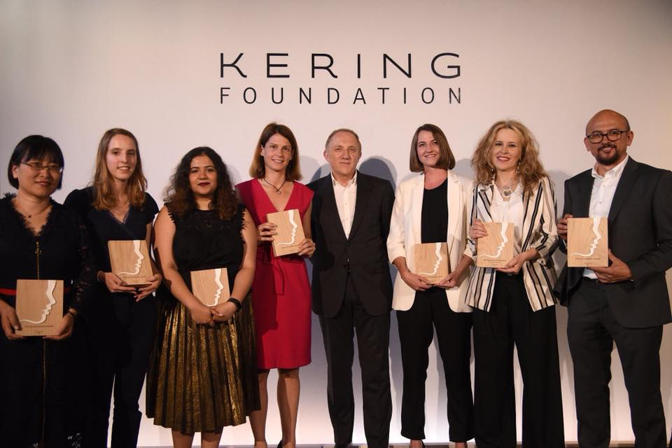

# 2018

We know we say this every year but really, 2018 was our best yet. We received many awards, got registered as a social enterprise, ran many campaigns, developed a self-help guide to mental health and well being, and changed our workflow to make it easier for a nimble team. We increased our reach on social media and we continually develop our engaging content to resonate with our global audiences. Our volunteers from around the world have been busy! 

## 2017: A review

2017 was a big year for feminism as #MeToo gave a platform to millions of women to share their experience of oppression, and for men and patriarchal systems to be brought to justice.  

2017 and 2018 has also thrown us many challenges. We lost many battles in the fight for intersectional feminism, from the resuilt of the Brazilian elections, to the impunity of sexual assault offenders in the US, to famous harassers facing no repercussions in Pakistan and India.

We launched three new projects, published our findings from the [Tech vs. Abuse](https://www.techvsabuse.info/) project, in collaboration with [Snook](https://wearesnook.com/), [SafeLives](http://www.safelives.org.uk/) and Comic Relief. We hoped to cross 1 million page views by 2018, and help more people facing abuse with our [guides and toolkits](https://chayn.co/tools/) by upping our Facebook and Twitter game because we our research showed that most women and survivors were finding us through social media (after searching on places like Google).

So, how did we do in 2018?

## 1. IMPACT NUMBERS

Across all our platforms and resources, we reached 
### 150,000 people, generating more than 500,000 page views. 

This brings our lifetime total to 
### 360,000 users and 1.2 million page views! 

We are over the moon.

These numbers look good but these are estimates. Every year we crunch the Google Analytics and gitbooks numbers to see how many people are viewing and using our resources. It’s our primary tool for measuring impact. Despite 2018 being the year we received the most exposure, our Google Analytics tokens stopped working which meant we had no usage data for the most part of 2018. As such, we’ve had to fill in the gaps using a hybrid of two methods: Some places we used the growth for previous years to predict an anticipated average throughout 2018 and in other places, we used a significantly lower percentage of the super-optimistic numbers from our web host. 

## 2. HIGHLIGHTS

**Awards**

What a whopper of a year it has been in comes to awards! We are incredibly humbled. From spending years explaining to people what Chayn does and the impact it creates (hence our cover photo for the report) to getting nominated for multiple awards this year - it has been a rollercoaster.

Our founder, Hera Hussain received multiple awards for her leadership and vision. As part of **MIT Technology Review’s [Innovators Under 35](https://www.technologyreview.com/lists/innovators-under-35/2018/)** Hera received an award as one of the “humanitarians using technology as a way to bring about a safer, healthier, and more equitable world."
 
She was nominated as **one of the 100 creative changemakers by The Dots & Squarespace ‘[Leaders with Social Heart](https://the-dots.com/projects/leaders-with-social-heart-100-creative-changemakers-248117?utm_source=nom)’ **and was recognised in [Forbes 30 Under 30](https://www.forbes.com/30-under-30-europe/2018/social-entrepreneurs/#de71fb05d8f3) Social Entrepreneurs of Europe.**

In the UK, the Prime Minister awarded Hera her **[Points of Light Award](https://twitter.com/PM4EastRen/status/1024220439277723649)** which recognises outstanding individuals who volunteer to make a difference in their communities. 

We also picked up the **Microsoft Spark Award** at the **Forbes 30 Under 30** event in Amsterdam.

Specific projects also received recognition in awards ceremonies. **The [Kering Foundation](https://www.facebook.com/chayn/posts/1996017840460083?__tn__=-R)** recognised the contribution of our chatbot project, Little Window, in the fight to end violence against women and girls (see this [video montage](https://www.youtube.com/watch?time_continue=64&v=s_Ob5be8vDQ)). 

Our work on Soul Medicine was recognised by **Comic Relief** who have awarded us a **£50k** extension to continue to develop this work. **The [WeWork Creator Awards](https://www.youtube.com/watch?v=lSwqawy2tN4)** recognised the potential of Chayn as a model for developing solutions to social issues and awarded us **£13k **in October 2018**.** We also received **$5k** from the Shuttleworth Foundation which helped us cover some of our tech costs.

**We also spoke at and participated in many events around the world. Here are a few of them:**

*   At the **meConvention**, Stockholm, Hera was [in conversation](https://www.youtube.com/watch?v=YBkyCRuR2Vw) with Tracy Chou, co-founder of Project Include discussing how company culture affects end products

*   At **[EmTech MIT](https://events.technologyreview.com/video/watch/hera-hussain-chayn-innovator/), Boston**, we spoke about taking on the infrastructure of the web, to create intersectional resources and solutions

*   Our Johanna spoke at **[DataKind UK](https://www.facebook.com/chayn/photos/a.611077615620786/2168996176495581/?type=3&__xts__%5B0%5D=68.ARBNPD-FiLlk1SPITrQLfJ9f3z0956KUbVU6I6tXp0hfRsikFwzkcORXE05aQ-xjNoDxHszh3lDwofyg_45eb-AxapMPBfcCmgz-xtwqSktQFYwZRtBP8haKYy7djn980vmr5jow68qwVx1iFHrrOZC60a-Su9TJHROoJYvxI2j4FIvEYt185RBEnaGf4i6iAVQwcTI_zI-IdW16EJLuWOaObU4&__tn__=-R)** about Little Window, our chatbot

*   Hera [spoke](https://twitter.com/m3_collective/status/1038010548988854273) at the **Forbes Summit Amsterdam** about intersectionality and diversity in tech

*   Hera also [represented](https://twitter.com/AmnaAbdul1983/status/1009214494843826187) us at **The Kering Foundation** award ceremony where we were one of the six honorees

*   We [hosted](https://twitter.com/ChaynHQ/status/1056547664806977536) a workshop about building an ethical chat bot at **Mozfest by Mozilla Foundation** in London

*   We attended and [got a prize](https://www.facebook.com/WeWorkUK/photos/a.1147424115411282/1147798618707165/?type=3&theater) at the **WeWork Creator Awards** and meet **Mila Kunis** who said she liked our website!

*   Hera spoke at **[Filanthropy’s 5 year bash](https://twitter.com/ChaynHQ/status/1062017189841113088)** about our incredible journey from raising a little over £700 at their event to now running multiple projects.

*   Dina Julietta [spoke](https://twitter.com/CentreHubertine/status/1064806521845018624) at the Les Cyberviolences Sexistes Et Sexuelles – Nouvelles Données Et Nouveaux Défis about our DIY online safety guide in Paris

**Press**

Off the back of our stellar award season, we’ve had some great coverage from the international media. Press attention is crucial in raising awareness of domestic violence and plays a key part in expanding Chayn’s outreach to survivors.

*   [MIT Technology Review](https://www.technologyreview.com/lists/innovators-under-35/2018/humanitarian/hera-hussain/) did a profile on Hera as one of the Innovators Under 35 in its class of 2018

*   Hera was [interviewed by Inkline](https://the-inkline.com/2018/06/20/chayn-using-technology-to-fight-domestic-violence/) on how Chayn uses tech to fight domestic violence

*   As a winner of Kering Foundation awards, Hera was [featured in an article on Women’s Wear Daily](https://wwd.com/fashion-news/fashion-scoops/kering-foundation-awards-reflect-metoo-moment-1202719210/) on crucial issues raised by the #MeToo movement

*   Hera was [interviewed by Fairplanet](https://www.fairplanet.org/story/a-platform-for-women-who-struggle-with-abusive-relationships/) on how Chayn designing to empower women facing abuse

*   After being named as one of MIT Review’s top 35 innovators, Hera was [featured in Boston Herald](http://www.bostonherald.com/business/business_markets/2018/06/mit_names_35_top_young_innovators_in_technology)

*   Hera was [featured in Inc Magazine](https://www.inc.com/catherine-perloff/meet-women-taking-over-mit-technology-reviews-35-innovators-under-35-list.html) with all the women winners of 2018’s MIT Technology Review’s Innovators under 35 list

*   [RTL Futur interviewed Hera](https://www.rtl.fr/actu/futur/comment-un-reseau-feminin-peut-favoriser-votre-carriere-et-plus-encore-7793583124) on how female networks bring women together to help them achieve personal and professional success

*   Hera interviewed with the [Sunday Times](https://www.thetimes.co.uk/article/porn-pop-culture-and-the-teen-abuse-crisis-b3pxxv6vm?fbclid=IwAR2gjYwd43Zmrxx2F_3z9csW47IaeZ8kAg-bS2rUVlFaQ297SVpHb3ojLcw) for an article on the culture of slut-shaming in today’s society and the impact this has on teen abuse

*   Hera wrote an article for [The Independent](https://www.independent.co.uk/voices/metoo-consent-dating-campaign-sexism-marital-rape-sexual-assault-a8180966.html?fbclid=IwAR35bRgj7PeiNb0iezn5yDCFrwfivQCQUBbVziyfYxfPTZ5pa-UCObOtk_g ) on how consent doesn't end with dating, that husbands should also ask for consent from their spouses

*   [Manchester Evening News](https://t.co/bbJsH6cnij) interviewed Hera about what led her to found Chayn and what support we’re now able to offer

*   Following on from Hera’s nomination for the Creator Awards, [Fundraising.co.uk](https://fundraising.co.uk/2018/10/24/three-uk-non-profit-founders-announced-creator-awards-finalists/ ) wrote a short feature on the awards and describing our work

*   Hera’s award from the Kering Foundation brought Chayn a double-whammy of international coverage this year: publications such as [Vogue Italia](https://www.vogue.it/news/appuntamenti-eventi/2018/06/26/premio-fondazione-kering-imprenditoria-sociale), [LesEchos](https://start.lesechos.fr/actu-entreprises/societe/violences-faites-aux-femmes-7-projets-innovants-recompenses-12179.php) wrote about the winners back in June when the awards were given out, but the Kering Foundation’s 10th anniversary in November brought a new wave of attention in the likes of [The Independent](https://www.standard.co.uk/fashion/kering-celebrates-ten-years-of-the-kering-foundation-paris-a4002991.html?fbclid=IwAR3z5e7C_x_LB-SQh7fCYRNz-9e12kMjjg7uF1-jynxN7BT8B3-QpzlghtQ), [Elle](https://www.elle.com/uk/fashion/a25354897/kering-foundation-celebrates-10-years/?fbclid=IwAR2PMZHQwWr_DP-yiMkd9JNZENVJw88oUTKQveVRDS8tGxZ9o9mRsEcE3wI), [GQ](https://www.gq-magazine.co.uk/article/kering-foundation-10-years?fbclid=IwAR2J0k4L1aCiOvjcAYLatqCH3pT7Gl2ZJyjIupMiUfAtRQyHQsvRefv_eQA) and [Wonderland](https://www.wonderlandmagazine.com/2018/11/29/kering-foundation-10-anniversary/?fbclid=IwAR1YchVPFwx6OlPzaweIgqF_UfsWqniNBohX3GdzwkNqLAqfcDiwqAeMM_k)

*   Suzanne Jacob the Chief Executive of SafeLives wrote a piece for the [Metro](https://metro.co.uk/2018/11/23/apps-are-being-used-by-abusers-to-control-victims-and-its-time-for-big-tech-companies-to-act-8166642/?fbclid=IwAR0ef8IjBvgs2-GVoy-X3pBmqUSQLz8wuHK_QvdEVQye65wLCd1TC10eP70) about the abuse of apps by abusers in controlling their victims, calling for tech companies to take responsibility. In this article Suzanne references Chayn as pioneering positive use of tech

*   Hera [spoke](https://pod.co/tech-for-good-live/tfgl-at-the-federation-episode-1-bias-tech-with-safiya-umoja-noble) with the indomitable Dr.Safiya Noble (author of [Algorithms of Oppression](http://bit.ly/AlgorithmsOpp )) on this Tech for Good live podcast as part of the Federation Presents

**Partnerships**

We love working with partners on the ground (and on the web) to move the needle on fighting gender-based violence. It’s why all of our resources are under Creative Commons licenses. 

This year, Chayn partnered with [Centre Hubertine Auclert](https://www.centre-hubertine-auclert.fr/) who translated the advanced DIY Online Safety guide and launched it! We also worked with [Spektrum](https://feministspectrum.org/) on translating and updating the Farsi version of our [DIY Online Safety](https://chayn.co/safety/) resource and [How to Build Your Own Domestic Violence Case Without A Lawyer](https://chayn.co/how-to-build-your-own-case/). We loved working with [Founders and Coders](https://foundersandcoders.com/) students to build and launch Little Window, our cat chatbot that has had more than 500 conversations so far.

**Blogs**

Although blogging has lost some ground due to the social media pattern of short forms for disseminating a message, in Chayn we believe that blog posts and social media can amicably coexist and be complementary. The issues Chayn focuses on, deserve undeniably a longer and more in-depth analysis and thanks to our volunteers listed below, we managed to host a few interesting blog pieces.

*   Following on from the globally-impactful #MeToo movement, [Serena ](https://medium.com/hack-for-chayn/8-ways-men-in-hollywood-have-failed-to-apologize-36f2d397d5dd?fbclid=IwAR2vU8fllJqm_6Aq6ShweS9NVtDY3pt6FzcqaRCOEySnlIYcj-Xs0WztvUY )addressed 8 ways in which Hollywood failed to offer a meaningful apology regarding  the sexual harassment and abuse allegations women reported against Harvey Weinstein

*   We used our workshop at Mozfest in London to get feedback on the Soul Medicine project by presenting challenges to attendees. [Dina](https://medium.com/soul-medicine/we-asked-mozfest-to-help-us-make-online-learning-inclusive-for-women-refugees-b632c2f9f0c2?fbclid=IwAR2tELZUKY06vNnh3__YbB-H8egIPrwb0rJjgLSl0xjF8ADCZpM2Hl1jodg ) described the experience in this blog post

*   Anne Sophie explained [issues](https://medium.com/hack-for-chayn/whats-wrong-with-the-french-media-63081130589e) in the way the French media were covering femicide, sexual assaults and rape accusations

*   There are numerous reasons to join Chayn. This [blog post](https://medium.com/hack-for-chayn/6-reasons-to-join-chayn-936b6b1eb1b5?fbclid=IwAR3AgrivIb_V-TKwkQmDE1ia1zVjqs9n1a0N_QXjAr5z1i5AT4VvQ9oJPoY) offers 6

*   We asked those who found Chayn resources beneficial to join the "Boost Chayn"group. [Hera ](https://medium.com/hack-for-chayn/have-you-used-chayns-resources-join-our-boost-chayn-group-to-give-feedback-5ef2811206ae?fbclid=IwAR1tsaq0g4t2AlJbZI6KCK-TmND0zvZV7YDiEqKrClkF8xZIORz9_EiRjpc)explains the importance of such exercise

*   In order to facilitate and optimize the users search,  Chayn has launched the "Little Window, a chat-box feature in the Chayn website. [Hera ](https://medium.com/hack-for-chayn/were-trying-something-new-say-hello-to-little-window-our-chatbot-36a65ac44fda?fbclid=IwAR1Nq3Js-e_GAmZwdeb_3D7MFwcMypd2L44jQfdcK1xvfnRV1OyYsP0crKw)writes about how the idea was developed to a project and the advantages that brought to users' interaction with website's content
 
*   Turning the Little Window into an interactive tool, Johanna approached Chayn and made it happen. Read her [insights ](https://medium.com/hack-for-chayn/building-little-window-how-we-created-a-chatbot-for-chayn-682ecf7bd495?fbclid=IwAR098-gRSBZ3Vve6HldLG-2Y8QAImo9gHE5m1edxya69ionz7cl149muMOg)from the process

*   One of our volunteers wrote a [post](https://medium.com/hack-for-chayn/how-a-book-and-friends-got-me-out-of-abuse-13cf19810e1b?fbclid=IwAR2vGfwNaaRsYLQLvDmK4TsxQwzqDCCKloOGsOnFxVVQIAcP-dIowRraufg) on the positive effects books can have in people trying to get over an abusive relationship

*   Gifs, our favourite way of communicating in the team, but they also help us to reach out and support our community. [Dina ](https://medium.com/hack-for-chayn/if-youre-not-using-gifs-to-reach-tech-your-community-what-are-you-doing-683f71ee3d8c)explains more. 

*   After a busy year of applying for grants, awards and partnerships, Hera wrote a piece reflecting on her ‘[worst grant interview](https://medium.com/hack-for-chayn/my-worst-grant-interview-36244a0818a3?fbclid=IwAR3csd-J0auS3At8Jr_Dm_lwNTRvSpaoSBo_G4PWvwuGaS1Ei6yySpvQsls)’ - 45 painful minutes of describing the key basics of the work at Chayn to completely underprepared interviewers. This insight into the worst end of the spectrum for grant interviews is a key reflection for people on both sides - those working in nonprofits and those holding the precious cheque books we rely on so to continue our work.

*   A brave survivor [shares her story](https://www.brit.co/facebook-employee-cyberstalking/) of getting stalked and cites our DIY Online Safety guide. 

## PROJECT UPDATES

_New projects_

**Little Window** (it’s live on our [website](https://chayn.co/)!) 

We launched Little Window April 2018, a multilingual chatbot that directs victims and survivors of abuse to the right information. The first was an insight from the 2016 [Tech vs Abuse](https://www.techvsabuse.info/) report which we undertook with Safelives and Snook, commissioned by Comic Relief looking at the use of technology by victims and practitioners in the UK. This resulted in the design challenge of the “15 mins window”. 

We found that often women had very short windows of opportunity when their partners were not around to find support online but that the online world can be a ‘rabbit hole’ of information. This is especially true for women who have multiple factors that change their circumstances. For instance, if you’re a Pakistani immigrant with low English skills stuck in an abusive relationship, not only is information in English useful but also Urdu. Similarly, there are many specialist services that you might want to search for charities that cater to women with children. Here is a quote from a woman we interviewed that particularly struck us:

”_It took me 15 clicks to find the information on a local refuge. If you only have 5 minutes alone, that’s at least 10 clicks too many._” Ultimately, we’re curating key information online for women experiencing domestic abuse in a way which is easy to find, simple to navigate and quick to interact with. We see ‘little window’ as one of the first chatbot and AI innovations at the intersection of gender-based violence and tech for good.

Since the launch we have been working on updating and improving our cat chatbot. Naturally, we asked and received insightful feedback from developers, designers, and users in order to improve our chatbot. In response to feedback, one of the changes will be making for the little window available in more languages. So far, Little Window has had more than 500 conversations, generating more than 5000 interactions.

**Getting better and moving on**

Our new mental health guide, “[Getting better and moving on](https://www.gettingbetter.chayn.co)” ([launched](gettingbetter.chayn.co) in April 2019) was researched and written in 2018. It was our largest research project this year. Mental health and wellbeing is something that cuts across all our tools and guides but we felt that we needed to do something bigger and more in-depth that helped people to understand what they are experiencing and the steps they can take to get through it.

The guide wants to cut through the taboo of mental health and make sure people can get the help they need. But it also acknowledges that in many places there is missing infrastructure and quality control of services offering support. So the help section of the guide is structured into three sections: things you can do in everyday life; self-help and support through online resources and apps; and finally- seeking professional help. This is about making sure that technology can be used to facilitate treatment and support to those facing mental health problems.  We want to create an intersectional resource that doesn't want to rely on existing infrastructure that is missing for the vast majority of women who experience abuse.

We used the end of the year to get feedback from therapists, counselors and social workers: this was to make sure that the information we are giving is based on the best available practice for supporting people. The UX team also focused on the design and functionality of the guide to make sure that the User Experience encourages users to keep working on their mental health and not feel overwhelmed. We did a [podcast](https://soundcloud.com/chayn-hq/gupshup-episode-3) about it this year in case you are interested.

There have been several challenges with the guide. Firstly, finding professionals to review the guide has been challenging and took longer than hoped to get responses. But we reached out to wider networks, flexed our social media skills and found a small but dedicated group of professionals who could give us the honest and focused feedback we needed. Secondly, the UX/Design took longer to kick off than expected. As this is a guide with a lot of heart in it, the expectations for its design are that much higher and time was lost to begin with discussing overall goals without making progress on the actual design. 

**Chayn Italia**

2018 saw [Chayn Italia](http://chaynitalia.org) increasing our social media presence and reach, improving our impact and presence at the local level and promoting existing resources to a wider audience. ChaynItalia.org reached thousands of new users online, generating more than 14,000 pageviews alongside 500 000 social media impressions. Our ground activities and open source materials were used by women’s aid shelters, schools and libraries all around Italy.

We started the year by launching a social media campaign around “feminist new year’s resolutions”. The objective was to give feminists tools, ideas and tips that could be used in daily situations to explain and defend their political and social positions. 

Like every year, Chayn Italia’s activism was as much offline as it was online. We attended two of the biggest public rallies at the national level. The first one took place on the occasion of the International Women’s Day, on the 8th of March, and the second one on 24th November, when we marched against gender based violence and the government's patriarchal and racist policies. 

One of the key ways Chayn Italia has been able to raise awareness has been through an active social media presence. So this year, we developed a long term strategy to codify this. We paid special attention to how we convey the global reach of the problem, by raising awareness on international news items. In particular, we covered some specific cases of brutal murders such as those of Laura Luelmo in Spain or Marielle Franco in Brazil that had a higher impact and reach, sparking reactions from our audience and community. We also developed online cards with useful information about gender based violence. These cards have helped us increase our audience to more than 6,300 likes and 500,000 impressions. 

We also organised a social media campaign about sexual consent. This campaign explained how rape, sexual assault, and sexual abuse can have different legal definitions and are different forms of violence.

Another important activity of 2018 was the promotion of [DIY Online safety guide](https://chayn.gitbook.io/basic-diy-online-privacy/it/summary). When women are not familiar with Internet safety fundamentals, the risks they face increase significantly. Through a specific social media campaign we’ve promoted this tool that teaches users the best practices and behaviours to hide their tracks on email, browsers, Facebook and other platforms.

One of our highlights of the year was publishing in-depth research on psychological violence (see [here](http://chaynitalia.org/violenza-psicologica/)). The research work started in 2017 to help women recognize this form of abuse, which despite being most common, is grossly underestimated. These guidelines make it easy to distinguish healthy conflict from abuse in a relationship. We also explained the effects of psychological abuse, why leaving the abusive partner could _feel and be_ difficult and where to start if someone wants to start their journey of recovery.

Finally, in 2018 we hosted trainings and projects in cooperation with the Anti Violence Centre Frida Onlus in Barcellona Pozzo di Gotto (Sicily). Notably, from January to March 2018 we organised a 40-hour course under the title: “Operatrice all’ascolto e all’accoglienza”. The course, provided for free to 30 women, aimed at training participants who aspire to become social workers in the field of support to women that have experienced gender-based violence. In April 2018, in cooperation with the same centre, we co-hosted a public event with Graziella Priulla (Italian sociologist) and Maria Rosa Cutrufelli (writer and journalist) about the difficulties of achieving women's freedom. 

**Soul Medicine**

Last year our development team scoped out a plan to bring to life courses that can aid victims of abuse. This was our first project led by a paid team to and this for us is a big change. Our volunteers handled the overall reviewing and vetted all the content and design decisions, the day-to-day tasks were handled by a team leader, four content writers, a UX designer, front-end developer and a backend developer.

We have developed six courses and were able to develop new content that we always wanted to. For instance a course on financial management, stress, confidence and applying for asylum based on gender-based violence. We also scoped how best to deliver the course material. In the end, we prioritised Facebook messenger and email over SMS which would incur a cost to the users. Once the courses were developed, we translated into Arabic and Urdu. While the platform isn’t live yet, we reached out to women living in domestic violence shelters and piloted the courses with them!

We got really excellent, positive feedback from the women who said they are really happy to know someone is addressing the challenges they’re facing and they felt heard their experiences were reflected in the lessons we have developed.  

We will be launching Soul Medicine in late 2019 and have been awarded further funding to continue to develop this work.

**More translations and localisation!**

Our expanded team worked with the following guides: Manipulation is Abuse; The Good Friend guide; and How To Build Your Own Case Against Your Abuser Without A Lawyer. They are now available in Portuguese. Here’s what’s amazing about this. Often it takes us a year to get a translation done with volunteer time whereas a golden duo of Juliana and Mariana were able to do this in 2.5 months! 

**Updating the Good Friend Guide**

We reviewed the initial version of the [Good Friend Guide](https://chayn.gitbook.io/the-good-friend-guide/) that we had remixed from Chayn Italia. We adapted the content to be more intersectional, in particular expanding the reach of the guide from a focus on women, to all those experiencing abuse. We also looked at aligning the information that is shared in other Chayn resources, particularly from our Chayn India and Chayn Pakistan sites. 

## CHALLENGES AND LEARNINGS 
**Maintaining an active community**

Our community has been around for 6 years and we’ve achieved a lot together, but that doesn’t make the challenge of building and sustaining an active online community any easier. We are always looking for people who can make a long-term commitment and turn their hands to many things. We are also based all over the world, so our activities have to be responsive to local needs, working styles and the everyday routine of volunteers. It’s not like turning up to spend a few hours at a charity once a month and then you are done.

We’ve got a well tested process for outreach, interviews and trying to get people involved as soon as they sign up. We know those first two weeks are critical. In 2018 we had a lot of new members. People really wanted to get involved in our work, especially as our profile kept rising but many people underestimated what it means to be an active (and proactive) member of the community. They struggled to find a way into the work and get deeply involved. 

Some of these people were able to say to us that it wasn’t working, others ghosted us. Ghosting is a sad issue because not only does it waste the time of the Executive team who have to repeatedly follow up with them, but also because it tells us that for some people, just the gratification of joining a charity is enough. The contribution doesn’t materialise. This is a deal breaker for us. We’ve often been told we’re quite strict in our induction and will turn people away if they can’t commit or delay our induction call or don’t show up. We will continue doing this because it saves us time down the line.

We’ve had a number of potential volunteers who said that they couldn’t volunteer because they didn’t want to use Facebook for privacy reasons. There were others who said that they weren’t active but were happy to check in. Given Facebook's questionable privacy policies, data sharing and inability to curtail offensive content, this raises an important question for us whether we chose to remain on the platform. Unfortunately we know from experience that organizing on another platform doesn’t work. Those who use Facebook for their social life tend to be extremely active on Chayn. If volunteers don’t use Facebook regularly, they find it hard to keep up with information and requests for support.

As always, we made it through to the end of the year with a small but super dedicated team - those who were able to find the rhythm of organising and were happy to get stuck in to co-work sessions rather than just phone calls. We’ve also been working on (re)finding a better balance between completing tasks, and enjoying our interactions (aka having gif competitions). 

**Skills gaps**

We had two major skills gaps in 2018: **communications** and **technical**.

We struggled to find enough volunteers who have the skills and confidence to curate and develop our social media channels. Some of our volunteers are happy to plan and share pre-planned posts but most are not comfortable responding to news and events. We also had a lot of press linked to our awards and didn’t have a dedicated press team. This meant that the work of running our comms outputs fell on a small number of people. We picked ourselves up a bit in the final quarter, running working sessions where we could plan a series of posts linked to events, then have a multi-time zone tag-team taking over from each other. 

We also lacked a stable technical team. We spent quite a bit of time doing quick hacks to patch our systems. Our GitBooks stopped working the night before Hera was going to be speaking at MIT Emtech, a moment we were all so proud of. So Tiffany had to spend the entire night and the morning bringing it all online. 

**(d) Balancing big and small projects**

From May 2018, we moved to working on one main project as a whole volunteer team, as well as having paid partners working on Soul Medicine (see below). The Getting Better and Moving On guide was a hugely important project for us, as it cuts across all of our work.  
 
Whilst everyone was motivated by the idea of the project, the scope of what we were planning was unwieldy and people started to check out. However, once we got to the design phase, people became interested again: they could see how all the information could come to life and how they could make it usable. It’s something we are considering for 2019. Evidently five projects at the same time is too much (pre-2018) and one project too little (2018) so maybe we need to try three projects at the same time?

**(e) In-depth learning from a funded project: Soul Medicine**

We learnt a lot about planning and working with external paid staff through this project. 

Firstly, we learnt a lot about the timescales we need to find and hire the right people to support our work. It always takes longer than we hope to find the right freelancers, and the impact of delays in our research for this project meant that  we pushed the timescales for recruitment, which resulted in more delays. Many freelancers did not have the level of time, skills and flexibility that we needed. We’re investing in building more ownership of this project across our volunteer team such as by recruiting more developers so they can provide additional capacity if they can’t meet our needs and timescales. 

We also realised that whilst we have considerable reach online,  we needed to test the content with women who are inside shelters. It took us a while to find a partner organisation that was quick to respond and set up a time for us to interview survivors. We learnt the importance of not being too online focused when we gave women Amazon vouchers and a few didn’t claim them. We now know physical gift cards or cash gifts are of much more use to women who are staying in shelters. 

Finally, we developed better processes for moving from content ideas within the team to users. More specifically- semantics matter. We were not expecting women to find the word “course” to be overwhelming and feel educational rather than empowering. We’ve since tested out a few words to see what works better.   

**Standing up for our values**

We responded to a social media post from a frontline organisation about the rights of trans-women to access their support. Our unwavering support for the rights of trans people resulted in a barrage of vitriol from individuals. This forced us to sit down and set out with clarity our position but in doing so it helped to bring our team together about our shared values. 

### Overall it’s been a smashing 2018 and you would have noticed, we took a small break from external events and press so we could recalibrate and move forward with our work. That break is now over so you’ll read, hear and see us a lot more.

